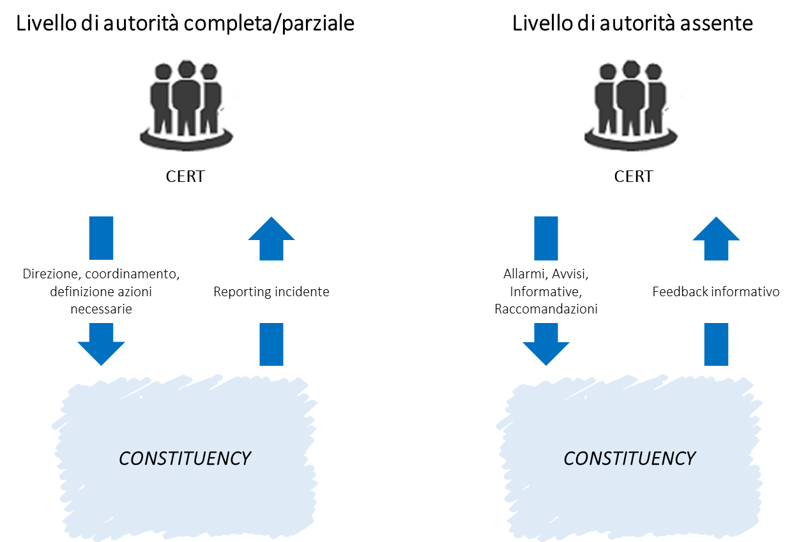
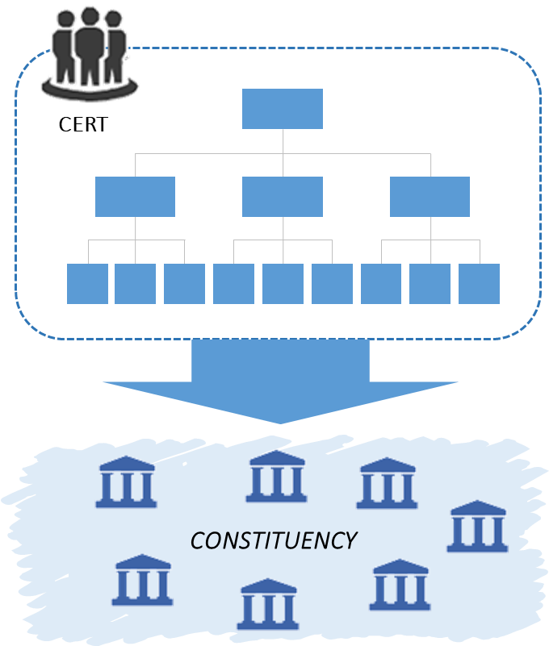
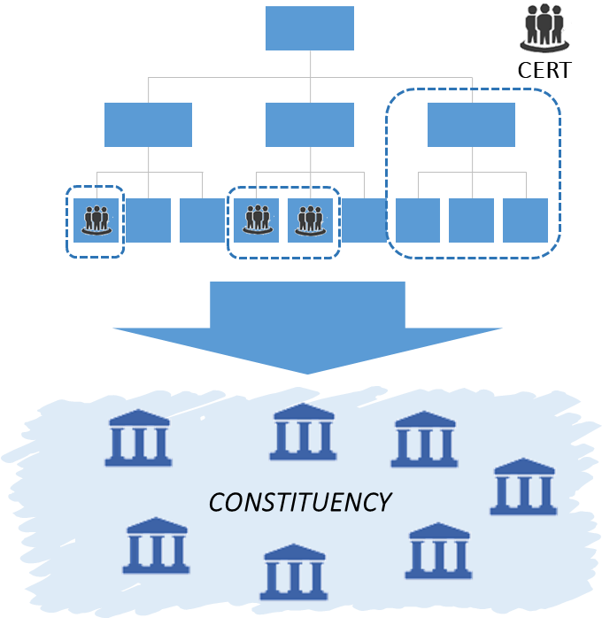
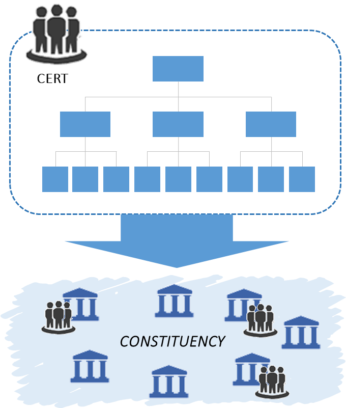

Modello organizzativo
=====================

La struttura organizzativa del CERT è un aspetto critico per supportare
operazioni efficaci e proattività nei confronti della propria constituency. In
termini di responsabilità e coordinamento, il CERT può organizzarsi in modi
diversi:

- *Livello di autorità completo*: può operare con piena autorità,
  guidando la constituency a compiere le azioni necessarie per migliorare la
  security posture dell'organizzazione o per recuperare da un incidente;

- *Livello di autorità condiviso:* può operare in un regime di autorità
  condivisa, collaborando con la constituency per influenzare il processo
  decisionale su quali azioni dovrebbero essere intraprese, senza tuttavia
  poterle imporre;

- *Livello di autorità assente:* può adottare un modello che non
  attribuisce autorità al CERT, limitandone la portata a azioni consultive per
  la constituency, senza alcun potere decisionale.

   Confronto tra livelli di autorità

Si noti che alcuni servizi offerti tipicamente da un CERT (e presentati più
avanti in dettaglio nel Cap. 9 “Servizi”), potrebbero essere offerti solo in
presenza di un livello di autorità completo o parziale nei confronti della
propria constituency. Si pensi ad esempio al caso di eventuali servizi di
tracciamento degli incidenti e di monitoraggio e rilevamento di tentativi di
intrusione, che solo in forza di specifici accordi contrattuali tra i membri
della constituency coinvolti e il CERT potrebbero essere erogati.

Sulla base del modello di autorità, il CERT può operare con modelli distribuiti,
centralizzati o coordinati. Il modello strutturale del CERT che si intende
creare dipenderà sia dalla mission e dai servizi che si vogliono offrire, sia
dalla constituency che sarà servita. In letteratura sono definiti tre modelli di
CERT operativi [66]_:

-  Indipendente;
-  Incorporato;
-  Campus.

.. [66] ENISA, “*Un approccio graduale alla creazione di un CSIRT*”, Documento
   WP2006/5.1(CERT-D1/D2) (2006)

Modello indipendente
--------------------

In questo modello il CERT viene sviluppato e agisce come organizzazione
indipendente, con una propria direzione e proprie risorse, pur essendo collocato
all’interno di un ente (che potrà essere a sua volta parte della constituency).
Il modello indipendente è basato su un CERT dedicato e centralizzato che detiene
la piena responsabilità e autorità per tutte le attività di analisi, gestione e
risposta agli incidenti. Il personale operativo è assegnato formalmente e
stabilmente al CERT, riportando al responsabile di questa unità (Responsabile
CERT, si veda par. 10.1.1).

   Modello indipendente

Modello incorporato
-------------------

Questo modello può essere usato se si intende creare un CERT all’interno di
un’organizzazione esistente, facendo leva su risorse già operanti ed allocate
presso altre strutture organizzative, che impieghi risorse dell’ente già
allocate presso altre strutture organizzative interne, ad esempio la Funzione IT
e di Sicurezza. Il CERT è guidato da un responsabile che risponde delle attività
complessive del CERT. Il responsabile riunisce gli specialisti necessari per
risolvere gli incidenti o lavorare alle attività del CERT e può chiedere
assistenza all’interno dell’organizzazione per ricevere sostegno.

   Modello incorporato

Modello campus
--------------

Ogni entità del campus è indipendente dal CERT e da tutti le altre entità che
compongono la constituency. Questo modello prevede che il CERT, pur essendo
distaccato, impieghi, oltre al personale assegnato in modo permanente, le
risorse che le altre organizzazioni appartenenti alla constituency sono in grado
di metterle a disposizione (ad esempio perché dotati di un proprio SOC) tra i
membri della constituency. Il CERT erogherà i suoi servizi sia verso gli enti
che forniscono le risorse, sia verso tutti gli altri membri della constituency.

   Modello campus

Il modello campus è quello più adottato nei CERT di settore, tra i quali
rientrano anche i CERT accademici/di ricerca e quelli militari, in quanto
consente di bilanciare ottimamente le necessità di coordinamento centrale con
quelle di autorità locale, come nel caso di utenti singoli o consorziati
riconducibili ad uno stesso ambito professionale o caratterizzati da interessi
comuni (ad esempio salute, trasporti, ecc.). Di contro, si possono considerare
il modello indipendente ed incorporato come assetti più indicati per un CERT
territoriale, anche in presenza di constituency caratterizzate da distribuzioni
geografiche particolarmente estese, che può operare in maniera efficace sotto la
supervisione dell’ente che lo ha istituito.
