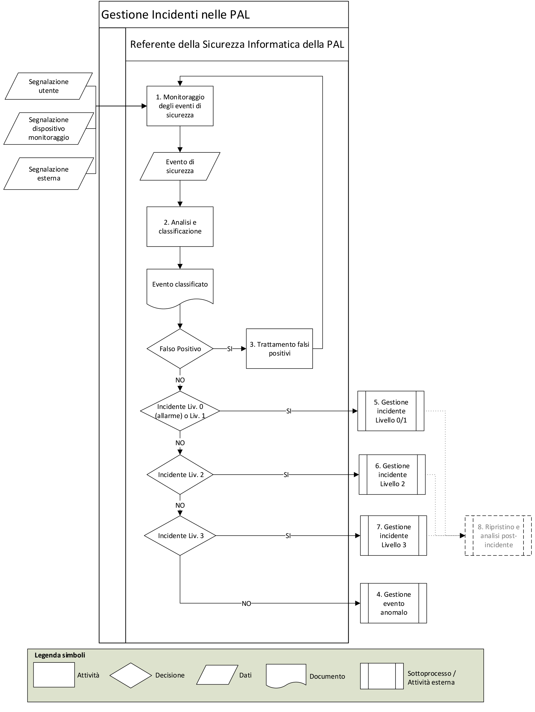
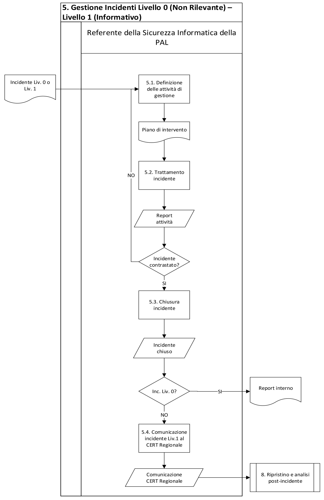
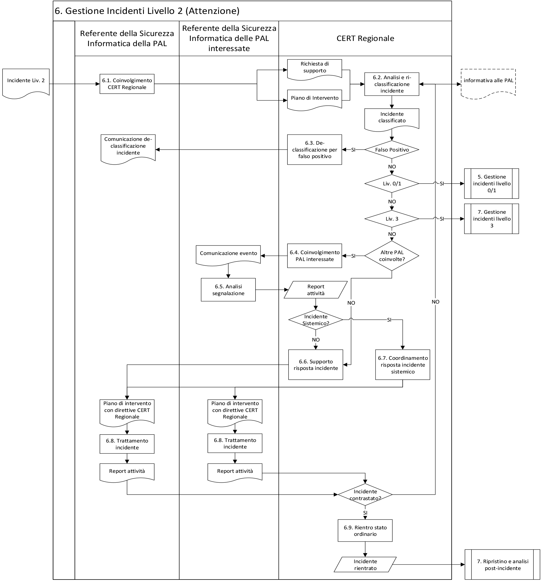
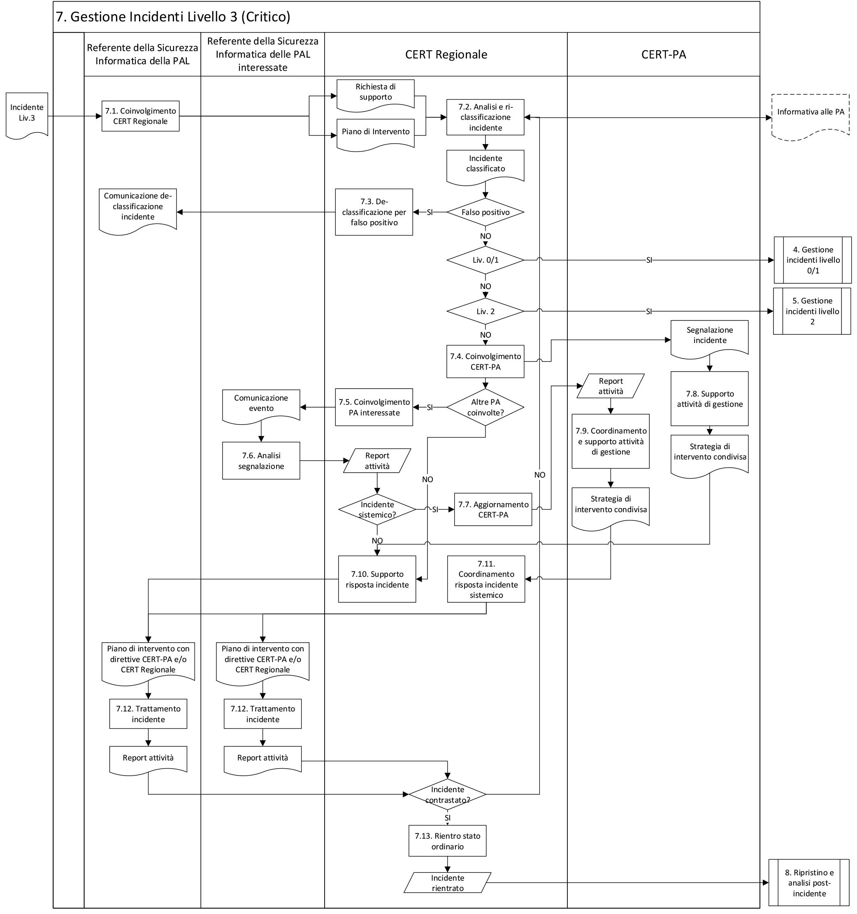
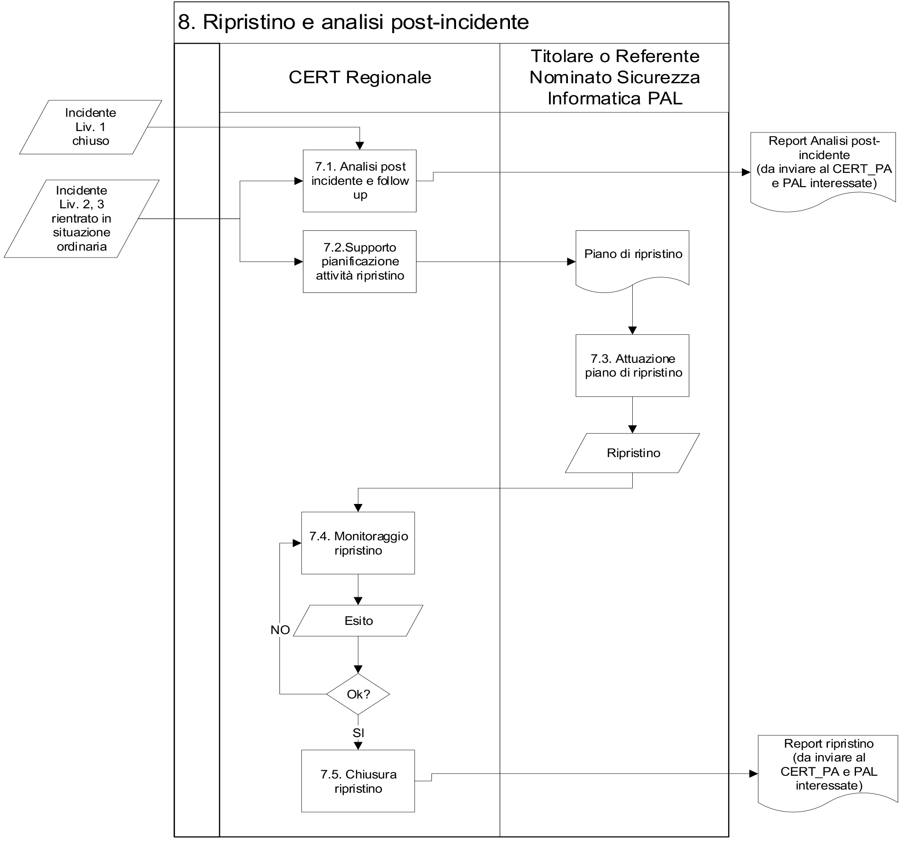

Processo di gestione degli incidenti di sicurezza
=================================================

Gli obiettivi principali del processo di gestione degli incidenti di sicurezza
informatica che occorrono nel dominio logico della PA sono:

- minimizzare l’impatto degli eventi malevoli;

- individuare ed attuare in maniera tempestiva idonee misure di
  contrasto/contenimento;

- individuare ed attuare tutte le attività di ripristino a seguito di
  un incidente;

- raccogliere dati per produrre statistiche in grado di alimentare il
  processo di analisi proattiva, finalizzato al rilevamento di eventi
  sospetti o di pattern comportamentali ripetuti nel tempo;

- attraverso i feedback ricevuti, aumentare all’interno della PA il
  grado di sensibilità verso le tematiche di sicurezza informatica e il
  livello di sicurezza delle infrastrutture tecnologiche gestite.

Data la possibile interconnessione delle infrastrutture appartenenti al dominio
della PA il raggiungimento di tali obiettivi può avvenire in maniera efficiente
ed efficace soltanto tramite una sinergia tra i vari soggetti che partecipano
alla sua sicurezza. Gli attori coinvolti e le strutture preposte – PAL, CERT
Regionale e CERT-PA in primis - devono pertanto svolgere il proprio ruolo con
attitudine proattiva sia in fase di prevenzione che di gestione degli incidenti.

Al fine di garantire un efficace modello di interazione e cooperazione tra tutti
gli attori coinvolti nel processo di gestione dell’incidente, è auspicabile che
all’interno delle PAL sia identificato un responsabile per la gestione delle
attività afferenti al dominio della Cyber Security (*Titolare o* *Referente
Nominato della Sicurezza Informatica*), che possa sovraintendere i processi di
gestione della sicurezza a livello locale e costituire il punto di contatto con
il CERT regionale con riferimento ai servizi di cyber security acquisiti. Nei
casi in cui sia stato designato all’interno dell’amministrazione, coincide con
la figura del Referente Nominato della Sicurezza Informatica.

Definizioni 
------------

Si riportano di seguito le principali definizioni e convenzioni adottate
nell’ambito del processo di gestione degli incidenti di sicurezza.

Evento di sicurezza
~~~~~~~~~~~~~~~~~~~

Con evento di sicurezza si indica qualsiasi situazione che si verifichi
nell’ambito di un determinato asset informatico, comunque rilevata, la cui
valenza è considerata significativa ai fini delle attività di gestione,
controllo della sicurezza e contenimento dei rischi ad essa correlati.

Gli eventi di sicurezza sono classificati in base alla seguente scala gerarchica
di importanza:

- *evento a basso impatto* (non significativo): qualsiasi evento
  gestito in maniera silente dal sistema di sicurezza della PAL
  interessata e che non richiede un trattamento ad hoc. Solitamente
  viene utilizzato a fini statistici;

- *evento significativo*: qualsiasi evento rilevato nell’ambito dei
  sistemi e delle infrastrutture ICT, che deve essere analizzato dal
  personale incaricato delle attività di monitoraggio (quali ad
  esempio, il rilevamento in tempo reale delle segnalazioni provenienti
  dai dispositivi di sicurezza, l’analisi dei log prodotti da tali
  dispositivi, la raccolta e la valutazione di comunicazioni su
  comportamenti anomali o eventi sospetti) e gestione degli allarmi di
  sicurezza;

- *evento critico*: qualsiasi evento significativo che, a seguito delle
  analisi effettuate dal personale incaricato, potrebbe sottintendere,
  direttamente o indirettamente, una violazione delle politiche di
  sicurezza applicate ai sistemi ed alle infrastrutture ICT.

Gli eventi di sicurezza, significativi e critici, sono ulteriormente
classificati in *allarmi*, *incidenti* e *incidenti a rilevanza sistemica*, in
accordo con le definizioni riportate nel seguito. A questo tipo di eventi si
applica l’intero processo di gestione incidenti, suddiviso nelle fasi di
**rilevazione**, **analisi**, **gestione** e **ripristino**.

Allarme di sicurezza o tentativo di attacco
^^^^^^^^^^^^^^^^^^^^^^^^^^^^^^^^^^^^^^^^^^^

Viene definito allarme di sicurezza o tentativo di attacco una segnalazione
derivante dal rilevamento di uno o più eventi che costituiscono una criticità
accertata per la sicurezza ICT, misurata sulla base di una scala di criticità
predefinita. Gli allarmi di sicurezza non causano danni e sono associati ad
attività che non costituiscono di per sé un pericolo diretto al patrimonio
informatico, ovvero a comportamenti anomali da parte di utenti e applicazioni
che non necessitano di un particolare intervento di contenimento, se non di
un’azione di monitoraggio per prevenire o contenere eventuali attacchi
susseguenti, ma che è, tuttavia, necessario registrare per una raccolta dei dati
a fini statistici e di valutazione.

La maggior parte di questi eventi è costituita da *atti ostili* - ovvero azioni
che cercano di pregiudicare un aspetto qualunque dei servizi o dei sistemi
tecnologici, ma che vengono efficacemente respinte dalle contromisure poste in
essere, e *prodromi di attacco* – ovvero attività di “raccolta delle
informazioni” non intrusive, che possono preludere ad un successivo attacco vero
e proprio.

Una lista, non esaustiva, di possibili allarmi è la seguente:

- azioni di enumeration (ad es. allarmi tipo ping sweep) dei nodi
  attivi su una sottorete;

- web crawling di un servizio web effettuato tramite tool automatici;

- scansioni di porte TCP/UDP aperte (host e port scan) effettuato una
  sola volta o comunque su destinazioni non particolarmente sensibili;

- accessi errati da parte di utenti che, pur comportando il lock di una
  singola utenza, non denotano una particolare attività illecita mirata
  al DoS, o all’accesso non autorizzato ai sistemi;

- fingerprinting su sistema operativo e applicativi installati sul
  sistema target;

- allarmi di tipo Policy Violations, determinati dalla presenza di
  software non autorizzato sui sistemi client (Instant Messaging, File
  Sharing, P2P, ecc.).

Incidente di sicurezza informatica
^^^^^^^^^^^^^^^^^^^^^^^^^^^^^^^^^^

Viene definito incidente di sicurezza informatica qualsiasi evento o insieme di
eventi che sottintendono una violazione delle politiche di sicurezza ICT fonte
di danno per gli asset ICT ovvero per il patrimonio informativo
dell’organizzazione e per il quale si rende necessaria l’applicazione di misure
di contrasto e/o contenimento da parte delle strutture preposte. Da questa
definizione si evince che l’elemento caratteristico distintivo di un incidente
di sicurezza è rappresentato dal nesso di causa-effetto tra evento rilevato e
danno subito dagli asset ICT.

In altri termini, un incidente di sicurezza rappresenta una particolare
tipologia di allarme i cui eventi sottintendono una constatazione conclamata di
danni, già subiti al momento del loro rilevamento e segnalazione. Una lista non
esaustiva di possibili incidenti per la PAL è la seguente:

- accesso non autorizzato agli asset ICT;

- diffusione non autorizzata di informazioni riservate provenienti
  dagli asset ICT;

- impersonificazione di utenti, tramite la compromissione delle
  credenziali personali di autenticazione;

- perdita o modifica delle configurazioni di sistema;

- decadimento dei livelli di servizio standard;

- interruzione di servizi ICT;

- constatazione di illeciti o azioni criminose apportate con l’ausilio
  delle risorse ICT di una PAL ai danni della stessa PAL o di terzi.

Incidente di sicurezza informatica a rilevanza sistemica delle PAL
^^^^^^^^^^^^^^^^^^^^^^^^^^^^^^^^^^^^^^^^^^^^^^^^^^^^^^^^^^^^^^^^^^

La correlazione sistemica tra le varie PA, in termini di servizi informatici e
di connettività, comporta un aumento della possibilità che eventi dannosi che
occorrono in un Ente possano ripercuotersi su altri Enti ad esso correlati. Un
incidente a carico di una PAL può acquisire rilevanza sistemica qualora
determini disservizi e/o alterazioni (in termini di riservatezza, integrità o
disponibilità) ad altri servizi erogati da altre PA. In caso di incidente a
rilevanza sistemica per la PA dovranno essere allertate e coordinate tutte le PA
coinvolte nella catena di correlazione sistemica, ovvero tutte le PAL che
presentano caratteristiche similari alla PAL primariamente impattata, sia in
termini di servizi che di tecnologie. Una lista non esaustiva di possibili
incidenti a rilevanza sistemica per la PAL è la seguente:

- attacco mirato, ad alto impatto in termini di riservatezza, integrità
  e disponibilità per i servizi ICT, specificatamente progettato per determinate
  piattaforme tecnologiche (sistemi operativi, middleware, applicativi di tipo
  infrastrutturale, ecc.) presenti in diverse PAL;

- interruzione di un servizio ICT che provoca un inaccettabile
  decadimento di prestazioni (o un’interruzione a sua volta) per altri servizi
  erogati da altre PAL sistemicamente correlate;

- perdita, alterazione o diffusione incontrollata di dati tali da
  provocare danni o alterazioni di servizio per altre PAL.

In tali casi, si renderà necessario attivare un processo di escalation verso il
CERT-PA per la presa in carico e relativa risoluzione dell’incidente di
sicurezza.

Criticità degli incidenti
~~~~~~~~~~~~~~~~~~~~~~~~~

Si definisce criticità di un incidente di sicurezza la misura qualitativa della
gravità dello stesso, in termini dei seguenti cinque scenari di impatto:

- *Persone*: impatto sulla salute e la sicurezza fisica dei cittadini;
- *Economia*: impatto economico provocato dall’incidente;
- *Servizi PAL*: quantità e tipologia di servizi critici coinvolti
  dall’incidente;
- *Immagine*: visibilità dell’incidente (o danno di immagine);
- *Sociale*: impatti sociali provocati dall’incidente.

La criticità dell’incidente viene espressa secondo una scala ordinale a quattro
valori o livelli di impatto (Livello 0 – Livello 3), secondo la seguente metrica
valutativa (scala degli impatti):

.. table:: Classificazione degli incidenti di sicurezza
   :name: classificazione-incidenti-sicurezza

   +------------------------------------+----------------------------------------------------+-------------------------------------------------------+-------------------------------------------------------+-------------------------------------------------------+
   | .. rst-class:: text-sans-serif p-3 | .. rst-class:: neutral-2-bg-a1 text-sans-serif p-3 | .. rst-class:: complementary-3-bg text-sans-serif p-3 | .. rst-class:: complementary-2-bg text-sans-serif p-3 | .. rst-class:: complementary-1-bg text-sans-serif p-3 |
   | Scenario di impatto                | Livello 0                                          | Livello 1                                             | Livello 2                                             | Livello 3                                             |
   +====================================+====================================================+=======================================================+=======================================================+=======================================================+
   | **Persone**                        | Nessun impatto significativo                       | Impatti limitati solo all’interno dell’ente           | Impatti limitati ma possibile interessamento di altre | Impatti limitati con interessamento di altre PAL o    |
   |                                    |                                                    |                                                       | PAL o privati                                         | privati                                               |
   +------------------------------------+----------------------------------------------------+-------------------------------------------------------+-------------------------------------------------------+-------------------------------------------------------+
   | **Economia**                       | Nessun impatto significativo                       | Impatto economico trascurabile e limitato all’ente    | Impatto economico limitato con possibile              | Impatto economico significativo o interessamento di   |
   |                                    |                                                    |                                                       | interessamento di altre PAL                           | altre PAL                                             |
   +------------------------------------+----------------------------------------------------+-------------------------------------------------------+-------------------------------------------------------+-------------------------------------------------------+
   | **Servizi PA**                     | Nessun impatto significativo                       | Impatto limitato a servizi interni all’ente           | Impatto limitato ma possibile interessamento di altre | Impatto limitato ma con interessamento di altre PAL o |
   |                                    |                                                    |                                                       | PAL o privati                                         | privati                                               |
   +------------------------------------+----------------------------------------------------+-------------------------------------------------------+-------------------------------------------------------+-------------------------------------------------------+
   | **Immagine**                       | Nessun impatto significativo                       | Danno di immagine ma problema limitato all’ente       | Danno di immagine con interessamento di altre PAL     | Danno di immagine con interessamento esterno alla PAL |
   +------------------------------------+----------------------------------------------------+-------------------------------------------------------+-------------------------------------------------------+-------------------------------------------------------+
   | **Sociale**                        | Nessun impatto significativo                       | L’incidente provoca malessere nel personale dell’ente | L’incidente provoca malessere nel personale in altre  | L’incidente provoca malessere anche all’esterno della |
   |                                    |                                                    |                                                       | PAL                                                   | PAL                                                   |
   +------------------------------------+----------------------------------------------------+-------------------------------------------------------+-------------------------------------------------------+-------------------------------------------------------+

Come si evince dalla tabella precedente, il livello di impatto associato ad un
evento di sicurezza rappresenta una misura qualitativa del danno provocato
dall’evento stesso. In generale:

- incidenti di Livello 0 sono assimilabili ad eventi di sicurezza non
  significativi;

- nel caso in cui ci siano impatti limitati che rimangono confinati
  all’interno dell’ente locale, si attribuisce il Livello 1;

- nel caso in cui ci siano impatti limitati ma che potenzialmente
  potrebbero interessare anche altre PAL ovvero un numero limitato di soggetti
  privati, si attribuisce il Livello 2;

- nel caso in cui ci siano impatti significativi (o sistemici) che
  interessano sicuramente altre PAL ovvero cittadini o soggetti privati, si
  attribuisce il Livello 3, attivando contestualmente il processo di escalation
  verso il CERT-PA.

Nel caso in cui un incidente presenti diversi scenari di impatto, il livello di
criticità è costituito dal massimo tra tutti i valori.

Priorità di gestione degli incidenti
~~~~~~~~~~~~~~~~~~~~~~~~~~~~~~~~~~~~

La priorità di trattamento di un evento e le modalità di gestione sono
attribuite in funzione del livello di impatto, secondo la metrica TLP a 4 valori
(o colori) riassunta nella seguente tabella sinottica:

.. table:: Definizione dei livelli di priorità
   :name: definizione-livelli-priorita

   +---------------+---------------------+--------------------------------------------------------------------------+-----------------+------------------+
   | Scenario di   | **Classificazione** | **Priorità**                                                             | **Modalità di   | **Ruolo CERT     |
   | impatto       |                     |                                                                          | gestione**      | Regionale**      |
   +===============+=====================+==========================================================================+=================+==================+
   | **Livello 0** | Allarme             | .. rst-class:: text-sans-serif neutral-2-color-b7 p-3                    | Locale all’Ente | \-               |
   |               |                     | **Non rilevante**                                                        | coinvolto       |                  |
   +---------------+---------------------+--------------------------------------------------------------------------+-----------------+------------------+
   | **Livello 1** | Incidente           | .. rst-class:: complementary-3-bg text-sans-serif neutral-2-color-b7 p-3 | Locale all’Ente | Informato        |
   |               |                     | **Informativo**                                                          | coinvolto       |                  |
   +---------------+---------------------+--------------------------------------------------------------------------+-----------------+------------------+
   | **Livello 2** | Incidente           | .. rst-class:: complementary-2-bg text-sans-serif neutral-2-color-b7 p-3 | Condivisa       | Supporto alla    |
   |               |                     | **Attenzione**                                                           |                 | gestione /       |
   |               |                     |                                                                          |                 | coordinamento    |
   |               |                     |                                                                          |                 | per incidenti    |
   |               |                     |                                                                          |                 | sistemici PA     |
   +---------------+---------------------+--------------------------------------------------------------------------+-----------------+------------------+
   | **Livello 3** | Incidente           | .. rst-class:: complementary-1-bg text-sans-serif neutral-2-color-b7 p-3 | Condivisa       | Supporto alla    |
   |               |                     | **Critico**                                                              |                 | gestione /       |
   |               |                     |                                                                          |                 | coordinamento e  |
   |               |                     |                                                                          |                 | coinvolgimento   |
   |               |                     |                                                                          |                 | CERT-PA          |
   +---------------+---------------------+--------------------------------------------------------------------------+-----------------+------------------+

Come indicato nella tabella precedente, il livello di impatto
dell’allarme/incidente determina la modalità ed il ruolo svolto dal CERT
Regionale nelle attività di gestione.

Attori coinvolti e responsabilità
---------------------------------

In questa sezione si definiscono gli attori coinvolti nel processo di gestione
degli incidenti e le rispettive responsabilità.

Referente della Sicurezza Informatica della PAL
~~~~~~~~~~~~~~~~~~~~~~~~~~~~~~~~~~~~~~~~~~~~~~~

Il Referente di Sicurezza ha la responsabilità di:

- effettuare il monitoraggio continuativo degli eventi di sicurezza
  provenienti dai dispositivi di sicurezza gestiti o da altre fonti;

- effettuare l’analisi e la classificazione degli eventi rilevati;

- gestire gli allarmi, applicando le procedure interne per il
  contrasto/contenimento degli allarmi;

- definire il piano di intervento per il trattamento di incidenti,
  sottoponendolo al CERT Regionale;

- interfacciarsi con il CERT Regionale, inviando comunicazione sugli
  incidenti di Livello 1 occorsi;

- effettuare il coinvolgimento ufficiale del CERT Regionale nella
  gestione di incidenti di Livello 2 e Livello 3;

- valutare l’applicazione di procedure di change management sui
  dispositivi di monitoraggio per la rimozione di falsi positivi;

- coordinare l’applicazione delle misure di trattamento definite nel
  piano di intervento secondo le procedure interne di trattamento degli
  incidenti;

- chiudere formalmente gli incidenti di Livello 0 e Livello 1;

- chiudere internamente gli incidenti di Livello 2 e Livello 3, a
  seguito della chiusura formale da parte del CERT Regionale.

CERT Regionale
~~~~~~~~~~~~~~

Il CERT Regionale ha le responsabilità di:

- effettuare l’analisi e la ri-classificazione degli incidenti
  segnalati;

- supportare le attività di risposta per incidenti di Livello 2 e
  Livello 3;

- integrare, ove necessario, il piano di intervento ricevuto dalle PAL
  con direttive di carattere strategico;

- coordinarsi con il CERT-PA per la gestione di incidenti di Livello 3;

- inviare al CERT-PA il risultato delle analisi effettuate e la
  strategia di gestione ipotizzata per il trattamento di incidenti di Livello 3;

- coinvolgere le PAL interessate in caso di incidenti a rilevanza
  sistemica;

- effettuare il coordinamento nella risposta degli incidenti a
  rilevanza sistemica o di incidenti a Livello 3;
- chiudere formalmente gli incidenti di Livello 2 e Livello 3;

- effettuare l’analisi post-incidente;

- monitorare le azioni di ripristino;

- rendicontare gli incidenti pervenuti per ciascun Livello e le azioni
  intraprese.

CERT-PA
~~~~~~~

Il CERT-PA ha la responsabilità di:

- assumere il coordinamento della gestione operativa degli incidenti di
  Livello 3;

- definire la strategia di contrasto in caso di incidenti di Livello 3,
  eventualmente verificando ed approvando quanto proposto dal CERT Regionale;

- coordinarsi con il CERT Regionale nella risoluzione degli incidenti
  di Livello 3.

Fasi del processo di gestione incidenti nelle PAL
-------------------------------------------------

Il processo di gestione incidenti è articolato nelle seguenti attività:

- **monitoraggio**, a carico delle singole PAL, finalizzato
  all’individuazione degli eventi rilevati automaticamente, ovvero alla
  ricezione delle segnalazioni di comportamenti anomali o sospetti;

- **analisi e** prima **classificazione** degli eventi di sicurezza
  rilevati a carico delle PAL coinvolte;

- attivazione del sotto-processo di **gestione degli allarmi o** di
  **gestione incidenti**, coinvolgendo o meno il CERT Regionale ed il CERT-PA,
  in funzione del livello di classificazione e dell’eventuale rilevanza
  sistemica dell’incidente;

- **monitoraggio delle attività di ripristino** ed analisi
  post-incidenti a carico del CERT Regionale.

La Figura 9.1 descrive il diagramma di flusso inter-funzionale del processo
generale di gestione incidenti nelle PAL, attivato dal Referente della Sicurezza
all’arrivo di una segnalazione di sicurezza; come evidenziato dalle linee
tratteggiate, il processo di ripristino ed analisi post-incidente viene attivato
al termine dei sotto-processi di gestione incidenti definiti per i diversi
livelli di impatto.

   Flusso di gestione incidenti nelle PA

Monitoraggio degli eventi di sicurezza
~~~~~~~~~~~~~~~~~~~~~~~~~~~~~~~~~~~~~~

La responsabilità delle attività continuative H24 7x7 di monitoraggio degli
incidenti di sicurezza è in carico al Referente di sicurezza della PAL, che
eventualmente si coordina con altre strutture operative interne o esterne.

Il processo di gestione incidenti nelle PAL si attiva quando gli operatori
responsabili del monitoraggio:

- rilevano le segnalazioni prodotte in tempo reale dai dispositivi
  informatici di monitoraggio, cui è affidato il compito di tracciare e
  segnalare tutti gli eventi di sicurezza ICT occorsi nel dominio degli
  asset ICT controllati;

- effettuano delle analisi periodiche dei log prodotti dai dispositivi
  di monitoraggio o da altre piattaforme di sicurezza gestite, per il
  rilevamento di pattern sospetti e/o eventi ripetuti, che possano
  evidenziare attività malevoli;

- raccolgono e valutano comunicazioni, verbali o scritte, di
  comportamenti anomali o di eventi sospetti provenienti da utenti o
  amministratori di sistema;

- raccolgono e valutano comunicazioni (sotto forma di alert o
  bollettini di sicurezza) provenienti da fonti esterne autoritative
  (tra i quali il CERT-PA e il CERT Regionale competente), circa nuovi
  scenari di rischio, comportamenti anomali o attacchi in corso ai
  danni di altri, che potrebbero avere impatto sul patrimonio
  tecnologico gestito.

L’output delle attività di monitoraggio è costituito dagli eventi di sicurezza
da sottoporre alla successiva fase di analisi e classificazione.

Analisi e classificazione
~~~~~~~~~~~~~~~~~~~~~~~~~

Il personale preposto effettua l’analisi e la classificazione degli eventi
segnalati, eventualmente avvalendosi di matrici diagnostiche e di procedure
operative interne per il riconoscimento e la classificazione degli eventi di
sicurezza.

L’output delle attività di analisi e classificazione è costituito dagli eventi,
categorizzati secondo la metrica precedentemente definita. In particolare:

- in caso di falsi positivi, gli eventi vengono registrati e si procede
  al relativo trattamento;

- in caso di allarmi di sicurezza (o incidenti a Livello 0) dovrà
  essere aperta formalmente una scheda di gestione allarme ed attivato
  il corrispondente sotto-processo interno;

- in caso di incidente di sicurezza a Livello 1 dovrà essere aperta
  formalmente una scheda di gestione incidente ed attivato il
  corrispondente sotto-processo interno;

- in caso di incidente di sicurezza a Livello 2 e Livello 3 dovrà
  essere aperta formalmente una scheda di gestione incidente e inviata
  al Referente della Sicurezza Informatica della PAL, che attiva il
  corrispondente sotto-processo e si coordina con il CERT Regionale
  nelle modalità di seguito illustrate;

- in caso di eventi anomali, che presentano un impatto sulla sicurezza
  informatica e per i quali non è possibile effettuare una
  classificazione, viene inviata formalmente una richiesta di supporto
  al CERT Regionale, che procede alle attività di classificazione e di
  attivazione del corrispondente sotto-processo di gestione.

In caso di più eventi concorrenti, viene data priorità alla gestione degli
eventi a maggior livello di criticità.

Trattamento falsi positivi
~~~~~~~~~~~~~~~~~~~~~~~~~~

Gli eventi identificati come falsi positivi non danno seguito ad allarmi e, una
volta accertati, deve essere valutata (in particolare nel caso di falsi positivi
persistenti) la possibilità di far filtrare tali eventi dai sistemi di
tracciamento, per non sovraccaricare le attività di monitoraggio con operazioni
ripetitive.

Tali attività sono condotte internamente alle PAL, attivando procedure
opportunamente codificate e documentate di change management degli apparati di
sicurezza.

Gestione evento anomalo
~~~~~~~~~~~~~~~~~~~~~~~

Nel caso di eventi che presentano degli impatti sulla sicurezza, ma per i quali
il Referente della Sicurezza Informatica della PAL non riesce ad effettuare in
autonomia la classificazione, viene inviata al CERT Regionale una richiesta di
supporto contenente:

- le evidenze rilevate,

- il risultato delle analisi eseguite e le motivazioni per le quali non
  si riesce ad effettuare la classificazione.

Il CERT Regionale, coordinandosi con il Referente della Sicurezza Informatica
della PAL, provvede all’analisi dell’evento, alla sua classificazione secondo la
metrica definita, e all’attivazione del corrispondente sotto-processo di
gestione coinvolgendo, qualora necessario, il CERT-PA.

Gestione incidenti di Livello 0 (Non Rilevante) e Livello 1 (Informativo)
~~~~~~~~~~~~~~~~~~~~~~~~~~~~~~~~~~~~~~~~~~~~~~~~~~~~~~~~~~~~~~~~~~~~~~~~~

Il sotto-processo di gestione degli incidenti di Livello 0 (o allarmi) e
incidenti a Livello 1 è un processo interno alla PAL, che prevede l’interazione
con il CERT Regionale esclusivamente in fase di rendicontazione finale, al
termine delle attività di trattamento.

Di seguito si riporta una descrizione di alto livello del sotto-processo,
rimandando ad eventuali procedure interne di gestione che tengano conto delle
specificità organizzative di ogni singola PAL.

Il diagramma di flusso inter-funzionale del sotto-processo di gestione incidenti
di Livello 0 e 1 è il seguente.

   Flusso di gestione incidenti Livello 0 e Livello 1

Si dettagliano di seguito le attività indicate in Figura 9.2 (per la legenda dei
simboli fare riferimento alla Figura 9.1).

Definizione delle attività di gestione
^^^^^^^^^^^^^^^^^^^^^^^^^^^^^^^^^^^^^^

Il Referente della Sicurezza Informatica della PAL accerta l’entità e la natura
degli eventuali danni subiti e definisce, in funzione delle evidenze raccolte,
la strategia ottimale di contrasto per l’incidente rilevato, tenendo conto dei
seguenti vincoli operativi:

- le misure di contrasto e contenimento individuate devono essere
  commisurate all’effettivo beneficio che si può ottenere, ovvero gli interventi
  devono arrecare il minor danno possibile agli asset ICT ed ai servizi da
  questi gestiti;

- i danni o i disservizi agli asset ICT, causati dall’attuazione delle
  misure di contrasto e contenimento, devono comunque essere inferiori a quelli
  conseguenti la violazione in essere;

- in nessun caso sono ammesse operazioni tali da comportare,
  direttamente o indirettamente, una violazione delle politiche di sicurezza in
  vigore, delle clausole contrattuali e delle vigenti leggi, ovvero non sono
  ammessi interventi che possano arrecare un qualsiasi danno, materiale o
  morale, a persone fisiche, sia dipendenti che esterni alla PAL coinvolta.

Durante questa fase il Referente di Sicurezza può interagire con altre strutture
operative interne, in funzione delle procedure di trattamento degli incidenti di
sicurezza definite localmente per ciascuna PAL. In particolare, deve essere
richiesta l’autorizzazione a procedere, nel caso in cui le attività da porre in
atto presentino un carattere di invasività o possano comunque comportare un
disservizio sui sistemi coinvolti.

Al termine di questa fase viene redatto un piano di intervento, dove è riportata
una descrizione dettagliata delle operazioni da effettuare per facilitare
l’intervento delle diverse strutture operative coinvolte.

Trattamento incidente
^^^^^^^^^^^^^^^^^^^^^

Il Referente di Sicurezza coordina l’applicazione delle misure di trattamento
definite nel piano di intervento, integrandosi con i gruppi operativi
all’interno della PAL ed eventualmente effettuando l’escalation di
responsabilità verso altre strutture, in funzione delle procedure interne di
trattamento degli incidenti di sicurezza.

Al termine dell’applicazione delle procedure di trattamento, il Referente di
Sicurezza valuta l’effettiva chiusura dell’incidente. Tali verifiche possono
essere effettuate analizzando gli eventi rilevati dai sistemi di tracciamento,
ovvero mediante ogni altra verifica volta a fornire l’evidenza del lavoro
svolto.

Al termine di queste verifiche:

- se l’incidente non risulta effettivamente rientrato il Referente di
  Sicurezza continua con le attività di gestione, definendo un nuovo
  piano di intervento e valutando, se necessario, una
  ri-classificazione dell’incidente stesso;

- se l’incidente risulta rientrato, il Referente di Sicurezza provvede
  alla chiusura formale dell’incidente.

Chiusura incidente
^^^^^^^^^^^^^^^^^^

Il Referente di Sicurezza effettua la chiusura formale dell’incidente e redige
un report di chiusura formale che contiene, come minimo:

- codice univoco identificativo dell’incidente;

- data e ora di apertura della scheda di gestione incidente;

- rapporto di constatazione incidente, comprensivo del livello di
  classificazione e dell’elenco dei danni subiti;

- documentazione degli interventi posti in atto e delle attività di
  ripristino effettuate;

- data e ora di chiusura dell’incidente.

Se l’incidente subito è di Livello 0 non viene effettuata alcuna comunicazione
al CERT Regionale archiviando localmente il report redatto. Se l’incidente è di
Livello 1, viene inviata comunicazione formale al CERT Regionale.

Comunicazione incidente Liv. 1 al CERT Regionale
^^^^^^^^^^^^^^^^^^^^^^^^^^^^^^^^^^^^^^^^^^^^^^^^

Il Referente della Sicurezza Informatica della PA invia, al termine delle
attività di gestione e dopo la chiusura dell’incidente, una segnalazione
informativa al CERT Regionale contenente i dettagli dell’incidente (di Livello
1) subito, attivando in tal modo il sotto-processo di ripristino e analisi
post-incidente.

Gestione incidenti di Livello 2 (Attenzione)
~~~~~~~~~~~~~~~~~~~~~~~~~~~~~~~~~~~~~~~~~~~~

Il diagramma di flusso inter-funzionale del sotto-processo di gestione degli
incidenti di Livello 2 è riportato nella figura seguente.

   Flusso di gestione incidenti Livello 2

Si dettagliano di seguito le attività indicate in Figura 9.3 (per la legenda dei
simboli fare riferimento alla Figura 9.1).

Coinvolgimento CERT Regionale
^^^^^^^^^^^^^^^^^^^^^^^^^^^^^

Nel momento in cui viene identificato un incidente di Livello 2, il Referente
della Sicurezza Informatica della PA coinvolge il CERT Regionale, inviando,
mediante i canali condivisi, una richiesta formale di supporto per la gestione
dell’incidente in corso.

Nella richiesta devono essere riportati tutti i dettagli necessari al CERT
Regionale per poter effettuare l’analisi e fornire le indicazioni utili al
trattamento dell’incidente. In particolare, devono essere indicate:

- data e ora di rilevamento evento;

- data e ora cui si riferiscono i danni rilevati;

- sistemi coinvolti dall’incidente;

- servizi coinvolti dall’incidente e relativa criticità;

- livello di classificazione assegnato;

- rapporto di constatazione incidente, comprensivo dell’elenco dei
  danni subiti.

Contestualmente alla richiesta di supporto, il Referente della Sicurezza
sottopone al CERT Regionale il piano operativo di intervento dove sono
dettagliate:

- le attività di contrasto e contenimento fino a quel momento
  intraprese;

- i risultati riscontrati;

- le azioni suggerite, in funzione delle conoscenze acquisite sul
  patrimonio tecnologico gestito, degli eventi rilevati e dei sistemi da essi
  coinvolti;

- i risultati attesi dalle attività suggerite.

Analisi e ri-classificazione incidente
^^^^^^^^^^^^^^^^^^^^^^^^^^^^^^^^^^^^^^

Il gruppo di analisti di sicurezza del CERT Regionale effettua una
ri-classificazione dell’incidente segnalato, analizzandone l’impatto in
un’ottica di tipo sistemico per la PAL e correlando le informazioni ricevute con
ulteriori indicazioni eventualmente ricevute da altre PAL, da altri CERT
Regionali o dal CERT-PA.

Al termine di questa classificazione, il CERT Regionale valuta se è necessario:

- passare alla de-classificazione dell’incidente in caso di Falso
  Positivo;

- de-classificare l’incidente a Livello 0 o 1, attivando il
  corrispondente sotto-processo e segnalandolo alla PAL coinvolta;

- aumentare la classificazione a Livello 3 attivando il corrispondente
  sotto-processo, ingaggiando il CERT-PA e segnalandolo alla PAL coinvolta.

In funzione della tipologia di incidente segnalato, il CERT Regionale può
inviare un’eventuale informativa di sicurezza alle PAL accreditate, per
segnalare l’occorrenza dell’incidente in corso ed innalzare il livello di
attenzione su determinati scenari di minaccia o particolari aspetti tecnologici
e organizzativi.

Se l’incidente (in base ai dati raccolti) presenta dei potenziali impatti sui
servizi o le infrastrutture di altre PAL differenti da quella originante, il
CERT Regionale procede al coinvolgimento di tutte le PAL interessate.

De-classificazione per falso positivo
^^^^^^^^^^^^^^^^^^^^^^^^^^^^^^^^^^^^^

Nel caso in cui gli analisti del CERT Regionale rilevino che l’incidente
segnalato dalla PAL non presenta carattere di rilevanza e non sottintende
direttamente o indirettamente ad alcuna violazione, lo de-classificano come
falso positivo, inviando una comunicazione alla PAL coinvolta contenente:

- risultato dell’analisi;

- motivazioni della de-classificazione;

- eventuali indicazioni per il trattamento del falso positivo segnalato
  e su come rimuoverlo dai dispostivi di monitoraggio.

Coinvolgimento PAL interessate
^^^^^^^^^^^^^^^^^^^^^^^^^^^^^^

In caso di incidente che presenti un potenziale impatto su diverse PAL, il CERT
Regionale coinvolge formalmente tutte le PAL interessate dall’incidente,
inviando ai relativi Referenti della Sicurezza Informatica una comunicazione
contenente (come minimo):

- la data e l’ora dell’incidente;

- la tipologia di sistemi e servizi coinvolti dall’incidente (sistemi
  operativi, tecnologie utilizzate, ecc.);

- i possibili danni che potrebbero essere provocati;

- qualsiasi altra informazione ritenuta necessaria per il trattamento
  di eventuali altri incidenti sistemicamente connessi all’incidente rilevato.

Ove possibile la comunicazione inviata deve essere anonimizzata, garantendo la
riservatezza delle informazioni e impedendo la circolazione di informazioni
comunque critiche.

Analisi segnalazione
^^^^^^^^^^^^^^^^^^^^

Il Referente della Sicurezza di ciascuna PAL analizza la comunicazione ricevuta
dal CERT Regionale, coinvolgendo, all’interno della propria PAL, eventuali altre
strutture operative in funzione delle procedure localmente definite.

In funzione della tipologia di evento segnalato, sono normalmente ipotizzabili i
seguenti scenari:

- qualora i sistemi della PAL coinvolta non risultino vulnerabili alla
  minaccia segnalata, il Referente di Sicurezza della PAL invia al CERT
  Regionale un report di riscontro;

- qualora non vi siano specifiche evidenze di applicazione della
  minaccia segnalata, viene aumentato il livello di monitoraggio nei
  confronti della specifica segnalazione ricevuta ed inviato dal
  Referente di Sicurezza al CERT Regionale un report di riscontro;

- qualora, in funzione della segnalazione ricevuta, venga rilevato
  internamente alla PAL un incidente di sicurezza precedentemente non
  rilevato (o comunque già rilevato ed in corso di classificazione), il
  Referente di Sicurezza attiva il corrispondente sotto-processo di
  gestione incidenti, inviando un report di riscontro al CERT Regionale
  e rimanendo in costante contatto con il CERT Regionale che coordina
  tutte le attività di risposta.

In caso in cui l’incidente segnalato presenti reali impatti su altre PAL
(incidente a rilevanza sistemica) il CERT Regionale procede al coordinamento
delle successive attività di risposta, tracciando formalmente la presenza di un
incidente sistemico. Negli altri casi il CERT Regionale offre il proprio
supporto specialistico alla PAL coinvolta nel trattamento degli incidenti
rilevati.

Supporto risposta incidente
^^^^^^^^^^^^^^^^^^^^^^^^^^^

Il CERT Regionale supporta il Referente della Sicurezza Informatica della PAL
nella risposta all’incidente rilevato e nella definizione del piano operativo di
intervento.

In particolare, il CERT Regionale analizza il materiale ricevuto dalla PAL e,
ove necessario, integra il piano di intervento con indicazioni di carattere
strategico, derivanti dalle informazioni desunte in fase di analisi e
ri-classificazione o comunque raccolte grazie al proprio ruolo di coordinamento
all’interno del dominio logico della Pubblica Amministrazione.

Il CERT Regionale condivide quindi il piano di intervento così integrato al
Referente della Sicurezza Informatica della PAL.

Coordinamento risposta incidente sistemico PAL
^^^^^^^^^^^^^^^^^^^^^^^^^^^^^^^^^^^^^^^^^^^^^^

Dopo la comunicazione formale di incidente sistemico della PAL, il CERT
Regionale assume il coordinamento delle attività di gestione dell’incidente
sistemico PAL.

Il CERT Regionale analizza il materiale ricevuto dalla PAL e, ove necessario,
integra il piano di intervento con indicazioni di carattere strategico,
derivanti dalle informazioni desunte in fase di analisi e ri-classificazione o
comunque raccolte grazie al proprio ruolo di coordinamento all’interno del
dominio logico della Pubblica Amministrazione sul territorio.

Durante tale fase il CERT Regionale coordina i Referenti della Sicurezza delle
PAL coinvolte, con i quali condivide il piano degli interventi necessari al
trattamento degli incidenti e dai quali riceve un aggiornamento costante sullo
stato di avanzamento delle attività di trattamento.

Trattamento incidente
^^^^^^^^^^^^^^^^^^^^^

I Referenti della Sicurezza delle PAL coinvolte (la PAL originante e le altre
PAL nel caso di incidente a rilevanza sistemica) ricevono il piano con gli
interventi di propria competenza e, in base alle procedure interne di
trattamento degli incidenti, curano l’applicazione delle misure di contrasto e
contenimento ivi definite coinvolgendo, all’interno della propria PAL, eventuali
altre strutture operative, in funzione delle suddette procedure.

Durante le attività di trattamento i Referenti della Sicurezza Informatica delle
PAL rimangono costantemente allineati con il CERT Regionale, al quale inviano
tutti gli aggiornamenti significativi sullo stato di avanzamento delle attività.

Al termine delle attività di trattamento, ciascuna PAL interessata redige un
report di rendicontazione, che permette al CERT Regionale di capire se lo stato
di emergenza è formalmente risolto o se è necessario procedere con una nuova
analisi e ri-classificazione dell’incidente. Tali verifiche possono essere
effettuate analizzando gli eventi rilevati dai sistemi di tracciamento, ovvero
mediante ogni altra verifica volta a fornire l’evidenza del lavoro svolto.

Rientro stato ordinario
^^^^^^^^^^^^^^^^^^^^^^^

Nel momento in cui si chiude lo stato di emergenza, il CERT Regionale effettua
la chiusura formale dell’incidente, redigendo un rapporto contenente (come
minimo):

- codice univoco identificativo dell’incidente;

- data e ora di apertura della scheda di gestione incidente;

- rapporto di constatazione incidente, comprensivo del livello di
  classificazione, dell’elenco dei danni subiti e delle PAL coinvolte in caso
  di impatti sistemici;

- documentazione degli interventi posti in atto e dei risultati
  ottenuti, specificando, particolarmente per gli incidenti sistemici, i
  sistemi/servizi delle varie PAL coinvolti dalle attività di trattamento;

- data e ora di chiusura dell’incidente.

Tale rapporto deve essere inviato alle PAL coinvolte, che a quel punto
provvedono internamente alla chiusura dell’incidente segnalato. Al rientro dello
stato ordinario, il CERT Regionale attiva il sotto-processo di ripristino e
analisi post-incidente.

Gestione incidenti di Livello 3 (Critico)
~~~~~~~~~~~~~~~~~~~~~~~~~~~~~~~~~~~~~~~~~

Il diagramma di flusso inter-funzionale del sotto-processo di gestione
degli incidenti di Livello 3 è riportato nella figura seguente.

   Flusso di gestione incidenti Livello 3

Si dettagliano di seguito le attività indicate in Figura 9.4 (per la legenda dei
simboli fare riferimento alla Figura 9.1).

Per comodità espositiva, si dettagliano a seguire solamente le attività
specifiche che caratterizzano l’attivazione del sotto-processo di gestione degli
incidenti di livello 3. Per i dettagli relativi alle altre attività si rimanda
alle precedenti sezioni del documento.

Coinvolgimento CERT-PA
^^^^^^^^^^^^^^^^^^^^^^

Contestualmente alla segnalazione, il gruppo di analisti di sicurezza del CERT
Regionale invia al CERT-PA il risultato delle analisi effettuate e la strategia
di intervento posta in essere dalla PAL originante per il trattamento
dell’incidente in corso, eventualmente integrata da ulteriori proposte definite
dal CERT Regionale in fase di analisi.

La strategia dovrà dettagliare:

- la descrizione dell’attacco subito, i sistemi ed i servizi coinvolti
  e una descrizione dei danni subiti;

- le attività di contrasto poste in essere e quelle sulle quali si
  richiede il consenso;

- gli scenari di minaccia che si intendono contrastare ed i risultati
  attesi dalle attività individuate.

Se l’incidente (in base ai dati raccolti) presenta dei potenziali impatti sui
servizi o le infrastrutture di altre PAL differenti da quella originante, il
CERT Regionale procede al coinvolgimento di tutte le PAL interessate.

Aggiornamento CERT-PA
^^^^^^^^^^^^^^^^^^^^^

Nel caso in cui l’incidente segnalato presenti reali impatti su altre PAL
(incidente a rilevanza sistemica), il CERT Regionale aggiorna il CERT-PA sullo
stato dell’Emergenza in corso, inviando:

- i rapporti di riscontro ricevuti dalle diverse PAL coinvolte;

- ogni altra informazione utile alla definizione/aggiornamento della
  strategia di intervento elaborata dal CERT-PA.

Il CERT Regionale rimane in contatto con i Referenti della Sicurezza delle PAL
coinvolte, dai quali riceve aggiornamenti sugli eventi in corso, che sottopone
per aggiornamento al CERT-PA.

Supporto attività di gestione
^^^^^^^^^^^^^^^^^^^^^^^^^^^^^

Il CERT-PA una volta attivato dal CERT Regionale:

- supporta e si coordina con il CERT Regionale nella gestione
  dell’incidente, che a sua volta coinvolgerà il Referente della Sicurezza della
  PAL interessata;

- verifica e approva formalmente la strategia di intervento elaborata,
  eventualmente integrandola con indicazioni di carattere strategico desunte
  grazie al proprio ruolo di coordinamento a livello nazionale nel dominio della
  PA e di interfacciamento con altri CERT Regionali.

Il CERT Regionale offre quindi il supporto specialistico nel trattamento
dell’incidente alle PAL coinvolte, in base alle informazioni/direttive
provenienti dal CERT-PA contenute nella strategia di intervento condivisa con il
CERT-PA, con il quale rimane costantemente allineato.

Coordinamento e supporto attività di gestione
^^^^^^^^^^^^^^^^^^^^^^^^^^^^^^^^^^^^^^^^^^^^^

Per Emergenze di carattere nazionale a rilevanza sistemica, il CERT-PA una volta
attivato dal CERT Regionale:

- supporta e si coordina con il CERT Regionale nella gestione
  dell’incidente, che a sua volta coinvolgerà i Referenti della Sicurezza di
  tutte le PAL interessate;

- correla tutte le informazioni ricevute dalle diverse PAL, aggiornando
  la strategia di intervento in funzione delle comunicazioni ricevute, durante
  la gestione dell’incidente, dal CERT Regionale e delle indicazioni di
  carattere strategico desunte grazie al proprio ruolo di coordinamento a
  livello nazionale nel dominio della PA e di interfacciamento con altri CERT
  Regionali;

- verifica ed approva formalmente la strategia di intervento elaborata.

Il CERT Regionale assume quindi il coordinamento nel trattamento dell’incidente
alle PAL coinvolte, in base alle informazioni/direttive provenienti dal CERT-PA
contenute nella strategia di intervento condivisa con il CERT-PA, con il quale
rimane costantemente allineato.

Supporto risposta incidente
^^^^^^^^^^^^^^^^^^^^^^^^^^^

Il CERT Regionale supporta il Referente della Sicurezza Informatica della PAL
nella gestione dell’incidente rilevato e nella definizione del piano operativo
di intervento.

In particolare, il CERT Regionale analizza il materiale ricevuto dalla PAL e,
ove necessario, integra il piano di intervento con le indicazioni di carattere
strategico provenienti dal CERT-PA e con le informazioni desunte in fase di
analisi e ri-classificazione dell’incidente.

Il CERT Regionale condivide quindi il piano di intervento così integrato al
Referente della Sicurezza Informatica della PAL.

Coordinamento risposta incidente sistemico PAL
^^^^^^^^^^^^^^^^^^^^^^^^^^^^^^^^^^^^^^^^^^^^^^

Dopo la comunicazione formale di incidente sistemico della PAL, il CERT
Regionale assume, in accordo con il CERT-PA, il coordinamento delle attività di
gestione dell’incidente sistemico PA.

Il CERT Regionale analizza il materiale ricevuto dalla PA e, ove necessario,
integra il piano di intervento con le indicazioni di carattere strategico
provenienti dal CERT-PA e con le informazioni desunte in fase di analisi e
ri-classificazione dell’incidente.

Durante tale fase il CERT Regionale coordina i Referenti della Sicurezza
Informatica delle PAL coinvolte, con i quali condivide il piano degli interventi
necessari al trattamento degli incidenti e dai quali riceve un aggiornamento
costante sullo stato di avanzamento delle attività di trattamento.

Rientro stato ordinario
^^^^^^^^^^^^^^^^^^^^^^^

Nel momento in cui si chiude lo stato di emergenza, il CERT Regionale effettua
la chiusura formale dell’incidente, redigendo un rapporto contenente (come
minimo):

- codice univoco identificativo dell’incidente;

- data e ora di apertura della scheda di gestione incidente;

- rapporto di constatazione incidente, comprensivo dell’elenco dei
  danni subiti e di eventuali impatti sistemici;

- documentazione degli interventi posti in atto, specificando,
  particolarmente per gli incidenti sistemici, i sistemi/servizi
  coinvolti dalle attività di trattamento;

- data e ora di chiusura dell’incidente.

Tale rapporto deve essere inviato al CERT-PA e alle PA coinvolte, che a quel
punto provvedono internamente alla chiusura dell’incidente.

Al rientro dello stato ordinario, il CERT regionale attiva il sotto-processo di
ripristino e analisi post-incidente.

Ripristino e analisi post-incidente
~~~~~~~~~~~~~~~~~~~~~~~~~~~~~~~~~~~

Il sotto-processo di ripristino e analisi post-incidente viene dettagliato nella
figura seguente.

   Flusso di ripristino incidente

Si dettagliano di seguito le attività indicate in Figura 9.5 (per la legenda dei
simboli fare riferimento alla Figura 9.1).

Analisi post-incidente e follow up
^^^^^^^^^^^^^^^^^^^^^^^^^^^^^^^^^^

Alla chiusura dell’incidente (di Livello 1 – 3), il Referente della Sicurezza
Informatica della PA, invia al CERT Regionale tutti i dati relativi
all’incidente gestito, necessari per consentire l’avvio dell’analisi
post-incidente.

Tale analisi viene effettuata dal CERT Regionale relativamente al dominio logico
di competenza, e va ad integrare le attività di analisi svolte parallelamente
all’interno di ciascuna PA alla chiusura dell’incidente.

Tale processo consiste in una serie di attività programmate, volte a verificare:

- le caratteristiche dell’agente di minaccia responsabile
  dell’incidente;

- le modalità di sviluppo dell’incidente, le circostanze e/o le
  vulnerabilità che lo hanno reso possibile;

- un eventuale piano propositivo per il miglioramento dello stato della
  sicurezza che tenda a contenere i rischi di nuovi incidenti di simile
  natura.

L’analisi post-incidente è un’attività posta sotto la responsabilità ed il
coordinamento del CERT Regionale che si avvale del Referente della Sicurezza
Informatica delle PAL e, ove necessario, di specialisti esterni. Essa comprende
le seguenti attività:

- raccolta e isolamento dei dati relativi all’incidente;
- analisi degli asset coinvolti;
- analisi degli eventi correlati all’incidente;
- costruzione dello scenario causa-effetto;
- valutazione degli impatti e potenziali propagazioni degli incidenti;
- conservazione delle fonti di prova per fini probatori.

Al termine delle attività il CERT Regionale dovrà produrre un rapporto di
analisi post-incidente, contenente le raccomandazioni necessarie ad evitare che
un tale evento possa ripetersi, e lo invia al Referente della Sicurezza
Informatica della PAL.

Nel corso di tutte le attività di analisi post-incidente deve comunque essere
garantita la stretta osservanza delle leggi e delle normative in materia di
privacy. Inoltre, tutto il personale componente il gruppo che effettua le
analisi è sottoposto alla stretta osservanza di una clausola di riservatezza,
che vieta la comunicazione a terzi di qualsiasi elemento o giudizio, anche a
titolo di parere personale, relativo alle informazioni raccolte.

Tutte le attività di analisi post-incidente devono comunque essere formalmente
autorizzate dal CERT Regionale, con l’indicazione delle finalità, del contesto,
dei limiti temporali e delle modalità di esecuzione delle analisi. Qualora tali
attività prevedano degli interventi all’interno della PAL, quest’ultimi devono
essere concordati con il Referente della Sicurezza Informatica, condividendo un
opportuno piano di azione nel quale devono essere dettagliate le attività svolte
ed il personale coinvolto.

Salvo disposizioni differenti per contesti specifici, la copia elettronica del
rapporto di analisi post incidente, dei dati raccolti nel corso delle analisi e
delle raccomandazioni emesse, devono essere custoditi a cura del CERT Regionale
per un periodo di dodici mesi solari. Dopo tale termine si provvederà alla loro
rimozione ed alla distruzione dei supporti mobili di archiviazione.

Supporto pianificazione attività di ripristino
^^^^^^^^^^^^^^^^^^^^^^^^^^^^^^^^^^^^^^^^^^^^^^

Alla chiusura formale dell’incidente che sancisce il termine dell’emergenza ed
il rientro dello stato ordinario, il CERT Regionale supporta il Referente della
Sicurezza Informatica della PA coinvolta dall’incidente nella definizione del
piano di ripristino.

Il piano di ripristino è finalizzato a riportare il patrimonio informativo
coinvolto dall’incidente nella situazione precedente all’incidente stesso e
contiene (come minimo):

- PA e relativi asset ICT coinvolti dall’incidente;
- piano delle attività di rientro e descrizione dei passi operativi da
  svolgere;
- funzioni e responsabilità coinvolte dalle attività operative;
- date di rientro previste.

Generalmente il piano delle attività deve prevedere un rientro nei tempi più
stretti possibile. Tuttavia, in funzione della tipologia, dell’estensione e
dell’impatto registrato sul patrimonio informativo a seguito dell’incidente
intercorso, è possibile avere piani di ripristino a lungo termine, che prevedano
un rientro alla situazione antecedente all’incidente nell’arco di mesi o anni.

Attuazione piano di ripristino
^^^^^^^^^^^^^^^^^^^^^^^^^^^^^^

Il Referente della Sicurezza Informatica della PA attua il piano di ripristino
concordato con il CERT Regionale, attivando i gruppi operativi all’interno della
PA ed eventualmente effettuando l’escalation di responsabilità verso altre
strutture, in funzione delle procedure interne di trattamento degli incidenti di
sicurezza.

Monitoraggio ripristino
^^^^^^^^^^^^^^^^^^^^^^^

Il CERT Regionale monitora periodicamente lo stato di avanzamento delle attività
di ripristino, coordinandosi con il Referente della Sicurezza Informatica delle
PA coinvolte e producendo dei SAL periodici sullo stato delle attività previste
dal piano di ripristino.

Al termine delle attività, si passa alla chiusura formale delle attività di
ripristino.

Chiusura ripristino
^^^^^^^^^^^^^^^^^^^

Il CERT Regionale chiude formalmente le attività di ripristino, redigendo un
report di ripristino che contenga:

- data di chiusura delle attività di ripristino;
- riferimenti al piano di ripristino definito e alle sue eventuali
  ri-pianificazioni successive;
- riferimenti ai SAL effettuati durante l’attività di monitoraggio;
- esito delle attività di ripristino effettuate.

Tale rapporto deve essere inviato al CERT-PA e alle PA coinvolte, che a quel
punto provvedono internamente alla chiusura dell’incidente.

Matrice delle responsabilità
----------------------------

Si riporta di seguito la matrice delle responsabilità relativa al processo di
gestione incidenti della PA, indicando per ciascuna attività sopra descritta,
l’attore coinvolto ed il grado di coinvolgimento, secondo la convenzione:

+-------+-----------------+
| **A** | Analizza        |
+-------+-----------------+
| **R** | Riceve          |
+-------+-----------------+
| **V** | Valida/Verifica |
+-------+-----------------+
| **E** | Effettua        |
+-------+-----------------+
| **S** | Supervisiona    |
+-------+-----------------+
| **I** | Viene Informato |
+-------+-----------------+
| **U** | Supporta        |
+-------+-----------------+

.. table:: Matrice delle responsabilità
   :name: matrice-responsabilita

   +------+---------------------------------+-------------+-------------+---------+
   | Id   | Attività                        | Referente   | CERT        | CERT-PA |
   |      |                                 | Sicurezza   | Regionale   |         |
   |      |                                 | Informatica |             |         |
   |      |                                 | PA          |             |         |
   +======+=================================+=============+=============+=========+
   | 1    | Monitoraggi o degli eventi di   | E           |             |         |
   |      | sicurezza                       |             |             |         |
   +------+---------------------------------+-------------+-------------+---------+
   | 2    | Analisi e classificazione       | E           |             |         |
   +------+---------------------------------+-------------+-------------+---------+
   | 3    | Trattamento falsi positivi      | E           |             |         |
   +------+---------------------------------+-------------+-------------+---------+
   | 4    | Gestione evento anomalo         | U           | E           |         |
   +------+---------------------------------+-------------+-------------+---------+
   | 5    | **Gestione Incidenti Livello 0  |             |             |         |
   |      | (Non Rilevante) – Livello 1     |             |             |         |
   |      | (Informativo)**                 |             |             |         |
   +------+---------------------------------+-------------+-------------+---------+
   | 5.1  | Definizione delle attività di   | E           |             |         |
   |      | gestione                        |             |             |         |
   +------+---------------------------------+-------------+-------------+---------+
   | 5.2  | Trattamento incidente           | E           | I           |         |
   +------+---------------------------------+-------------+-------------+---------+
   | 5.3  | Chiusura incidente              | E           |             |         |
   +------+---------------------------------+-------------+-------------+---------+
   | 5.4  | Comunicazio ne incidente Liv.1  | E           | R           |         |
   |      | al CERT Regionale               |             |             |         |
   +------+---------------------------------+-------------+-------------+---------+
   | 6    | **Gestione Incidenti Livello 2  |             |             |         |
   |      | (Attenzione)**                  |             |             |         |
   +------+---------------------------------+-------------+-------------+---------+
   | 6.1  | Coinvolgimento CERT Regionale   | E           |             |         |
   +------+---------------------------------+-------------+-------------+---------+
   | 6.2  | Analisi e riclassifi cazione    | I           | E           |         |
   |      | incidente                       |             |             |         |
   +------+---------------------------------+-------------+-------------+---------+
   | 6.3  | De-classificazione per falso    | I           | E           |         |
   |      | positivo                        |             |             |         |
   +------+---------------------------------+-------------+-------------+---------+
   | 6.4  | Coinvolgimento PAL interessate  | I           | E           |         |
   +------+---------------------------------+-------------+-------------+---------+
   | 6.5  | Analisi segnalazione            | E           | I           |         |
   +------+---------------------------------+-------------+-------------+---------+
   | 6.6  | Supporto risposta incidente     | R           | E           |         |
   +------+---------------------------------+-------------+-------------+---------+
   | 6.7  | Coordinamento risposta          | R           | E           |         |
   |      | incidente sistemico PA          |             |             |         |
   +------+---------------------------------+-------------+-------------+---------+
   | 6.8  | Trattamento incidente           | E           | I, S        |         |
   +------+---------------------------------+-------------+-------------+---------+
   | 6.9  | Rientro stato ordinario         | I           | E           |         |
   +------+---------------------------------+-------------+-------------+---------+
   | 7    | **Gestione Incidenti Livello 3  |             |             |         |
   |      | (Critico)**                     |             |             |         |
   +------+---------------------------------+-------------+-------------+---------+
   | 7.1  | Coinvolgimento CERT Regionale   | E           |             |         |
   +------+---------------------------------+-------------+-------------+---------+
   | 7.2  | Analisi e ri-classificazione    | I           | E           |         |
   |      | incidente                       |             |             |         |
   +------+---------------------------------+-------------+-------------+---------+
   | 7.3  | De-classificazione per falso    | I           | E           |         |
   |      | positivo                        |             |             |         |
   +------+---------------------------------+-------------+-------------+---------+
   | 7.4  | Coinvolgimento CERT-PA          | U           | E           | V       |
   +------+---------------------------------+-------------+-------------+---------+
   | 7.5  | Coinvolgimento PA interessate   | I           | E           |         |
   +------+---------------------------------+-------------+-------------+---------+
   | 7.6  | Analisi segnalazione            | E           | I           |         |
   +------+---------------------------------+-------------+-------------+---------+
   | 7.7  | Aggiornamen to CERT-PA          | U           | E           | V       |
   +------+---------------------------------+-------------+-------------+---------+
   | 7.8  | Supporto attività di gestione   |             | R           | E       |
   +------+---------------------------------+-------------+-------------+---------+
   | 7.9  | Coordinamento e supporto        |             | R           | E       |
   |      | attività di gestione            |             |             |         |
   +------+---------------------------------+-------------+-------------+---------+
   | 7.10 | Supporto risposta incidente     | R           | E           | I       |
   +------+---------------------------------+-------------+-------------+---------+
   | 7.11 | Coordinamento risposta          | R           | E           | I       |
   |      | incidente sistemico PAL         |             |             |         |
   +------+---------------------------------+-------------+-------------+---------+
   | 7.12 | Trattamento incidente           | E           | I, S        | I       |
   +------+---------------------------------+-------------+-------------+---------+
   | 7.13 | Rientro stato ordinario         | I           | E           |         |
   +------+---------------------------------+-------------+-------------+---------+
   | 8    | **Ripristino e analisi post-    |             |             |         |
   |      | incidente**                     |             |             |         |
   +------+---------------------------------+-------------+-------------+---------+
   | 8.1  | Analisi post-incidente e        | U           | E           |         |
   |      | follow-up                       |             |             |         |
   +------+---------------------------------+-------------+-------------+---------+
   | 8.2  | Supporto pianificazione         | U           | E           |         |
   |      | attività di ripristino          |             |             |         |
   +------+---------------------------------+-------------+-------------+---------+
   | 8.3  | Attuazione piano di ripristino  | E           | I           |         |
   +------+---------------------------------+-------------+-------------+---------+
   | 8.4  | Monitoraggio ripristino         | I, U        | E           |         |
   +------+---------------------------------+-------------+-------------+---------+
   | 8.5  | Chiusura ripristino             | R           | E           |         |
   +------+---------------------------------+-------------+-------------+---------+
