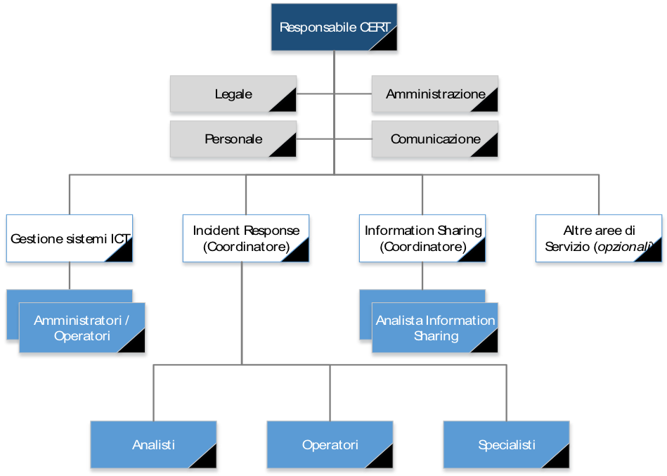
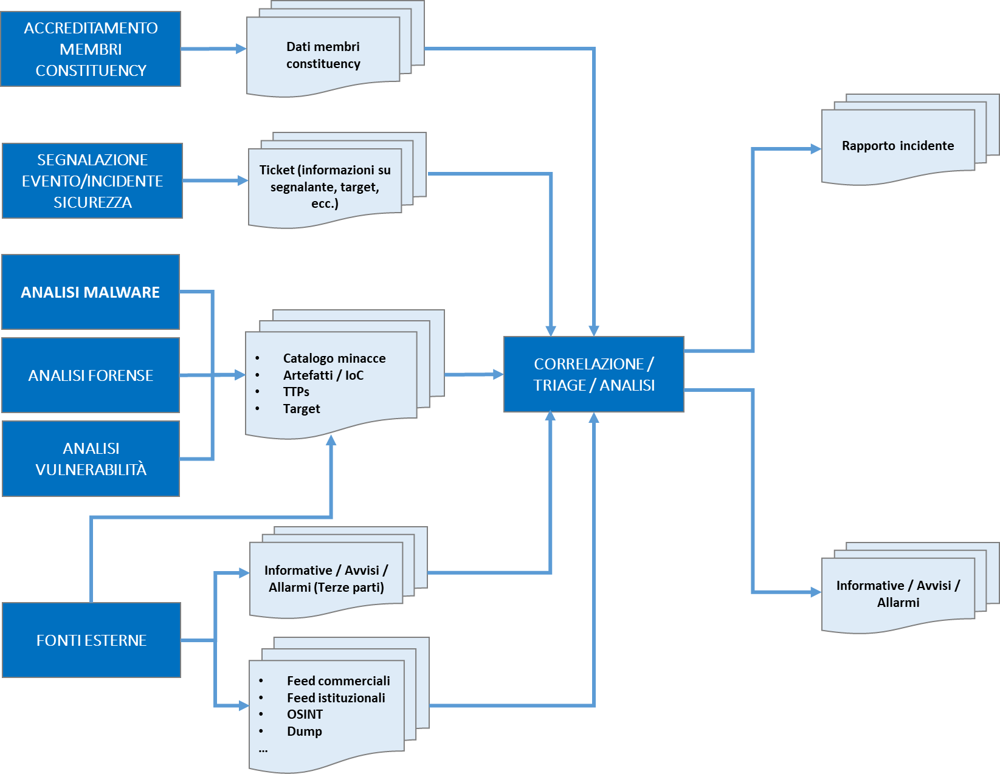
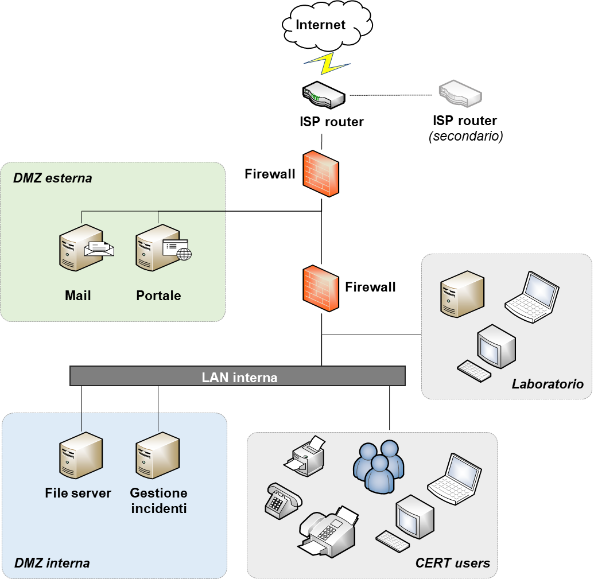

Risorse
=======

Struttura organizzativa e risorse umane
---------------------------------------

Per raggiungere gli obiettivi definiti per la strategia del CERT è consigliato
definire adeguatamente una struttura organizzativa in grado di evolversi
coerentemente con lo sviluppo dei processi e dei servizi offerti dal CERT nel
tempo, i ruoli chiave e le rispettive competenze e responsabilità.

L’organizzazione interna deve essere infatti oggetto di revisione nel tempo al
fine di determinare un corretto dimensionamento e livello di specializzazione
della struttura in relazione al volume ed alla tipologia di eventi ed incidenti
di sicurezza gestiti, alle fonti informative e di intelligence analizzate ed
alle relazioni di information sharing attivate verso la constituency.

L’articolazione organizzativa di un CERT dipende innanzitutto dalla struttura
esistente nell’organizzazione ospitante e dalle caratteristiche della comunità
di riferimento, nonché dalla possibilità, e relativa facilità, di poter
ricorrere, in modo permanente o in funzione di specifiche esigenze, alle
competenze di figure specialistiche presenti all’esterno.

A prescindere dalle considerazioni precedentemente espresse, per avviare le
attività di un CERT è auspicabile definire una struttura organizzativa in grado
di presidiare le seguenti aree:

- *Management*: che detiene la responsabilità dei compiti di
  pianificazione strategica, direzione ed indirizzo del CERT nonché di attivare
  le relazioni con la constituency e stabilire accordi di collaborazione con le
  altre organizzazioni pubbliche e private;

- *Operations*: con responsabilità della gestione complessiva e
  dell’operatività dei servizi erogati nei confronti della constituency. Figure
  che tipicamente rientrano in tale categoria sono costituite dagli operatori e
  dagli analisti, affiancati da team di esperti specializzati in singole aree di
  competenza (es. specialisti di prodotto, ecc.). A fronte di portafogli di
  servizi più articolati e definiti, potrebbe affiancarsi a questa anche un’area
  di specializzazione relativa ai servizi riconducibili alla Ricerca e Sviluppo
  – altrimenti parte della più ampia area delle Operations.

- *Processi di supporto*, che consentono il funzionamento complessivo
  dell’intera struttura; come si è visto, tale area comprende i processi di
  amministrazione e controllo, la gestione delle infrastrutture IT, inclusi i
  server e gli strumenti in uso esclusivo al CERT, la gestione ed
  amministrazione del personale, ecc. All’intero di tale ambito rientrano anche
  processi fondamentali per l’espletamento delle funzioni del CERT, quali quello
  di gestione della comunicazione interna ed esterna e l’area legale.

Si noti che durante il periodo di avvio del CERT, in cui non tutti i ruoli
potrebbero essere formalmente assegnati, dovranno essere in ogni caso
identificate le figure che, durante il periodo transitorio, assumeranno le
rispettive responsabilità.

Una struttura organizzativa, che vede il coinvolgimento delle figure
professionali necessarie per presidiare le aree precedentemente descritte,
potrebbe essere rappresentata come segue:

   Esempio di struttura organizzativa

Tale rappresentazione prende in considerazione le aree e i profili che devono
essere attivati per soddisfare i fabbisogni riconducibili alla gestione dei
servizi “core”. Atri profili sono da ritenersi come opzionali in fase di avvio
all’interno dell’organico del CERT, anche in relazione ad eventuali ulteriori
servizi offerti verso la constituency (“Altre aree di Servizio”).

I ruoli chiave che devono essere definiti nell’ambito del modello di CERT
proposto, e le principali responsabilità e competenze richieste, necessari per
garantire il corretto funzionamento dei servizi erogati ai soggetti accreditati,
sono delineati nei paragrafi seguenti. Per ciascun ruolo viene inoltre proposta
una possibile mappatura rispetto ad alcuni dei profili delineati all’interno del
modello fornito dall’*e-CF*, *European e-Competency Framework* [72]_ (CWA
16458-1:2018 (E)).

.. [72] http://www.ecompetences.eu/ict-professional-profiles/

Management
~~~~~~~~~~

**Responsabile CERT**

Riferimento e-CF: *Information Security Manager Role*

*Responsabilità*

- Identificare, definire e progettare i servizi CERT in base ai
  requisiti della constituency ed alle esigenze di protezione.

- Sviluppare, implementare e mantenere processi, policy e procedure e
  definire le linee guida per il miglioramento.

- Allocare le risorse necessarie per garantire un corretto
  funzionamento del CERT.

- Definire il piano di sviluppo e potenziamento per processi, risorse e
  tecnologie.

- Gestire e organizzare il team del CERT (formazione, incarichi di
  ruolo, ecc.).

- Rappresentare il punto di contatto con la constituency, con la
  comunità di riferimento e con i soggetti istituzionali in merito
  all'esecuzione dei servizi.

- Definire e gestire le comunicazioni verso l’esterno e supervisionare
  i processi di escalation.

- Definire e riesaminare gli indicatori di prestazione e qualità
  chiave.

- Assicurare la conformità alle policy e alle procedure del CERT.

*Competenze richieste*

- Conoscenza delle esigenze della constituency.

- Capacità di esercitare una presenza autorevole e di comando, come
  esperto in materia, durante le situazioni di crisi per gestire le
  comunicazioni relative agli incidenti di sicurezza.

- Capacità di gestire e allocare le risorse del team, assegnando le
  diverse priorità per ottenere risultati misurabili nel corso del
  programma.

- Forti capacità decisionali, con una comprovata capacità di valutare
  costi e benefici delle possibili azioni e identificare quelle più
  appropriate.

- Forti abilità comunicative nei confronti di diversi tipi di
  interlocutori.

Il Responsabile CERT deve designare, e rendere noto alla constituency e alla
comunità, all’interno del team un soggetto delegato che lo possa sostituire e/o
farne le veci in casi di assenza o indisponibilità temporanea o prolungata.

Operations
~~~~~~~~~~

**Coordinatori (Incident Response / Information Sharing)**

Riferimento e-CF: *Service Manager Role*

Sono figure con compiti di indirizzo e coordinamento dei team di rispettiva
competenza, necessarie a guidare l’efficacia e l’efficienza dei servizi e
processi gestiti, dei quali monitorano le prestazioni, valutando e suggerendo
raccomandazioni per il miglioramento continuo.

**Analista Incident Response**

Riferimento e-CF: *Systems Analyst Role, Systems Architect Role, Technical
Specialist Role*

*Responsabilità*

- Analizzare e gestire i ticket relativi agli incidenti di sicurezza e
  documentare le azioni intraprese.

- Applicare la classificazione degli incidenti in base ai livelli di
  classificazione previsti dalla metodologia adottata.

- Analizzare e riportare gli incidenti rilevanti al Team Leader,
  definendo con questi un piano di risposta agli incidenti per gestire
  tutte le attività richieste.

- Fornire supporto nell’identificazione degli step di ripristino.

- Aggiornare la Knowledge Base con i risultati dell'analisi post-mortem
  sugli incidenti, al fine di sviluppare / aggiornare le procedure di
  risposta agli incidenti.

- Fornire i dati di input per il monitoraggio delle prestazioni dei
  processi di gestione degli incidenti.

*Competenze richieste*

- Capacità di eseguire analisi sugli allarmi e sulle segnalazioni di
  incidenti di sicurezza.

- Conoscenza delle tecniche di analisi degli incidenti e di analisi del
  malware e dei casi di utilizzo.

- Capacità di comprendere ed implementare soluzioni per la correzione e
  risoluzione di vulnerabilità tecniche.

- Conoscenza dei sistemi operativi e delle tecnologie in uso presso la
  constituency di riferimento.

In funzione del livello di specializzazione richiesta e dei servizi attivati,
l’analista potrebbe presentare livelli di seniority differente e/o ambiti di
competenza specifici. Ad esempio, potrebbero essere reclutati analisti dei
malware con competenze specifiche sull’analisi del codice eseguibile, sia in
modalità statica che dinamica, così come analisti forensi, dedicati a gestire la
raccolta di evidenze e l'analisi delle stesse in concomitanza di un incidente
relativo alla sicurezza delle informazioni, documentando il tutto in modo che
sia correttamente presentabile in sede processuale [73]_.

.. [73] Si veda a tal fine lo studio pubblicato da CLUSIT (“*Certificazioni
   Professionali in Sicurezza Informatica 2.0*”, disponibile al
   seguente link:
   https://clusit.it/wp-content/uploads/download/Q09_web.pdf) che
   propone una raccolta delle diverse certificazioni professionali in
   materia di sicurezza informatica, presentate nei diversi ambiti
   applicativi (organizzativo, organizzativo/tecnologico, tecnologico
   vendor neutral e tecnologico di prodotto).

**Operatore Incident Response**

Riferimento e-CF: *Technical Specialist Role*

*Responsabilità*

- Monitorare i dispositivi e l'infrastruttura in tempo reale,
  analizzando i log degli eventi e tutti gli altri input ricevuti.

- Rappresentare il punto di contatto verso gli utenti.

- Aprire ticket per tutte le segnalazioni interne ed esterne, richieste
  di lavoro e di informazioni.

- Eseguire una prima analisi dell’incidente ed effettuare il triage.

- Definire la strategia di risposta iniziale agli incidenti.

- Gestire l'escalation verso le altre entità coinvolte secondo le
  procedure stabilite.

- Fornire i dati di input per il monitoraggio delle prestazioni dei
  processi di gestione degli incidenti.

*Competenze richieste*

- Capacità di comprendere e riconoscere vulnerabilità tecniche.

- Conoscenza e capacità di utilizzo ed amministrazione di strumenti di
  trouble ticketing.

- Conoscenza dei sistemi operativi e delle tecnologie in uso presso la
  constituency di riferimento.

**Specialista Incident Response**

Riferimento e-CF: *Service Support Role*

Tali figure detengono una ampia conoscenza delle tecnologie che degli strumenti
utilizzati per esaminare la sicurezza di sistemi e reti e competenze estese
all'ingegneria e sviluppo del software, alla programmazione ed ai linguaggi di
scripting.

*Responsabilità*

- Gestire e monitorare eventi di sicurezza e il comportamento dei
  prodotti di sicurezza.

- Fornire supporto nell’aggiornamento della Knowledge Base.

- Monitorare e misurare le metriche associate ai controlli di
  sicurezza.

- Lavorare a stretto contatto con altri analisti per identificare e
  affrontare le minacce in modo tempestivo.

- Gestire e risolvere i problemi operativi che coinvolgono i controlli
  di sicurezza.

*Competenze richieste*

- Capacità di eseguire analisi sugli allarmi e sulle segnalazioni di
  incidenti di sicurezza.

- Conoscenza dei sistemi operativi e delle tecnologie in uso presso la
  constituency di riferimento.

- Capacità di analizzare i flussi di pacchetti per identificare le
  anomalie.

- Esperienza nell’implementazione e nell’aggiornamento dei controlli di
  sicurezza e delle best practices.

**Analista Information Sharing**

Riferimento e-CF: *Information Security Specialist Role*

*Responsabilità*

- Supportare il Team Leader nella definizione della strategia di
  comunicazione in caso di minacce e/o attacchi in corso.

- Selezionare i contenuti da diffondere all’esterno in base ai livelli
  di confidenzialità delle informazioni.

- Identificare e gestire i canali per la diffusione e la comunicazione
  delle informazioni verso l’esterno.

*Competenze richieste*

- Conoscenza delle tecniche di comunicazione e gestione dei rapporti
  con i media.

- Esperienza nella redazione e pubblicazione di contenuti tematici.

- Conoscenza delle caratteristiche e dei servizi offerti dal CERT.

Personale di supporto
~~~~~~~~~~~~~~~~~~~~~

L’operatività del CERT dipende anche dalla presenza e dalle attività condotte da
personale di supporto ai processi operativi, quali:

- personale dell’area Information Technology, che ha la responsabilità
  di implementare, gestire e mantenere aggiornati i sistemi e le
  infrastrutture informatiche in dotazione al CERT – sia di
  funzionamento che a supporto dell’erogazione dei servizi alla
  constituency [74]_;

- personale dell’area Amministrazione e Finanza, con responsabilità di
  gestire le risorse contabili al fine di garantire un adeguato
  controllo amministrativo, fiscale e finanziario dell’organizzazione,
  oltre a consentire la gestione del personale sotto il profilo
  amministrativo;

- personale dell’area Comunicazione, con il compito di supportare il
  management nella gestione delle comunicazioni con gli stakeholder del
  CERT e di mantenere costantemente aggiornati i contatti all’interno
  ed all’esterno dell’organizzazione, ad esempio attraverso la
  preparazione e distribuzione di news e bollettini e la gestione dei
  canali di comunicazione attivati dal CERT;

- personale dell’area Legale, che fornisce un supporto specialistico in
  materia normative e in merito alla possibilità di divulgare le
  informazioni in accordo con le policy del CERT, le leggi ed i
  regolamenti applicabili.

.. [74] Le competenze richieste a tali figure possono essere individuate nei
   seguenti profili proposti dall’e-CF: ICT Operations Manager Role;
   Network Specialist Role, Systems Administrator Role; Data
   Administrator Role.

Pur riconoscendo la centralità delle attività di formazione del personale
interno, la velocità di cambiamento degli scenari di rischio potrebbe richiedere
talvolta l’intervento di figure esterne specializzate, in grado di fornire
supporto mirato, nonché le linee guida per l’internalizzazione di competenze
specifiche sulla base dei progetti svolti in collaborazione con figure
consulenziali esterne.

È difficile fornire requisiti ragionevoli per un dimensionamento iniziale di un
CERT regionale, poiché vari fattori influenzano il numero di risorse necessarie.
Prendendo in considerazione le esperienze di CERT di tipo nazionale/governativo
[75]_, un dimensionamento adeguato da cui partire è compreso tra 3 e 5 FTE
(quando i servizi sono forniti solo durante l’orario d'ufficio), fino ad
arrivare a 6-8 FTE nel caso di realtà amministrative più complesse.

.. [75] Si vedano anche ENISA, “Baseline capabilities for National /
   Governmental CERTs, Part 1”, Version 1.0 (2009), ENISA, “Baseline
   capabilities for National / Governmental CERTs, Part 2, Policy
   Recommendations”, Version 1.0 (2010), ENISA, “ENISA’s recommendations
   on baseline capabilities”, Update, December 2014 (2014)

Al fine di fornire livelli di servizio sostenibili, indipendentemente dalla
posizione per cui sono stati assunti, le risorse dovrebbero detenere un’ampia
gamma di competenze per poter ricoprire più ruoli in una fase di avvio dei
servizi. L’ipotesi di operatività 24/7/365 nell’ambito della constituency dovrà
essere valutata in ragione del portafoglio di servizi, della struttura e delle
responsabilità del team, considerando anche opzioni di reperibilità da remoto,
al fine di garantire comunque tempi di risposta rapidi, specialmente per i
rapporti sugli incidenti.

Modello dati e informazioni
---------------------------

I dati gestiti da un CERT seguono un ciclo vitale, costituito da cinque distinte
fasi:

- raccolta;
- conservazione;
- utilizzo;
- diffusione;
- distruzione.

La creazione di un CERT è finalizzata a consentire ai membri della constituency
di mettere in atto una risposta ottimale – in funzione preventiva o reattiva – a
minacce o violazioni in ambito informatico. Per perseguire questo obiettivo, il
CERT presumibilmente costituirà e gestirà una specifica banca dati in cui
memorizzare le violazioni riscontrate e le eventuali minacce preventivate,
creata mediante le segnalazioni dei vari utenti. Il CERT, pertanto, potrà
considerarsi il gestore di tale banca dati.

È presumibile che le informazioni fornite da ciascun utente segnalante rivestano
un elevato tasso di riservatezza, volto a tutelarne l’immagine; di conseguenza,
è altrettanto probabile che l’utente interessato sia disponibile a condividere
queste informazioni a condizione che le stesse siano trattate nel rispetto di
rigorose regole di confidenzialità. Queste regole di confidenzialità determinano
precisi obblighi di comportamento che vincolano il CERT ed i membri della
constituency; a tal proposito si potrebbe anche valutare un diverso livello di
trasparenza nei flussi informativi:

- dal segnalante al CERT;
- dalla banca dati CERT agli altri membri della constituency.

Il primo flusso potrebbe avvenire “in chiaro”, in modo da permettere al CERT di
effettuare tutte le valutazioni del caso senza condizionamenti di sorta.
Diversamente, il flusso di informazioni dalla banca dati CERT al resto della
constituency potrebbe vedere “oscurate” le informazioni identificative del
segnalante, in aggiunta all’obbligo di confidenzialità dei partecipanti. In
sintesi, gli obblighi di confidenzialità potrebbero prevedere il divieto di:

- divulgare ogni informazione del CERT a terzi non autorizzati ad accedervi;

- utilizzare tali informazioni per finalità o con modalità diverse da
  quelle espressamente previste;

- lasciare incustodite tali informazioni in modo da permetterne l’acquisizione
  da parte di terzi non autorizzati.

In linea teorica, si dovrebbe propendere per ritenere che i flussi informativi
oggetto del servizio CERT non contengano informazioni suscettibili di
identificare, direttamente o indirettamente, un individuo; cioè, che tali flussi
non abbiano necessità dei “dati personali” per perseguire le finalità
evidenziate. Infatti, è presumibile che le informazioni contenute possano essere
riconducibili ad organizzazioni o ad altre entità impersonali ma non ad
individui.

Dati in movimento e dati statici
~~~~~~~~~~~~~~~~~~~~~~~~~~~~~~~~

Con dati in movimento si intendono tutti quei dati in transito da un punto ad un
altro attraverso la rete. Tutti i dati coinvolti nei flussi informativi diretti
al o provenienti dal CERT si possono considerare dati in movimento. La
protezione di questi dati si rende necessaria e critica dal momento che i dati
in movimento sono considerati maggiormente vulnerabili.

I dati statici sono dati del CERT che, non essendo attivamente in movimento, si
trovano conservati o archiviati in dispositivi adibiti a tale scopo. In generale
si tende a considerare i dati statici come meno vulnerabili rispetto ai dati in
movimento, ma molto spesso chi attacca ritiene più conveniente dirigere i suoi
sforzi verso dati statici.

Il profilo di rischio dei dati in generale, siano essi in movimento o statici,
dipende in ogni caso dal livello delle misure di sicurezza che si adottano per
proteggere entrambe le categorie di dati. Adottare misure adeguate in tal senso
è divenuto un imperativo per ogni tipo di organizzazione, dal momento che gli
attacchi volti a sottrarre o compromettere dati sensibili stanno costantemente
crescendo in termini di sofisticatezza.

Come detto, i dati possono essere esposti al rischio sia se in movimento che se
statici; sarà pertanto necessario prevedere delle forme di tutela per entrambe
le situazioni. La cifratura gioca un ruolo di primo piano quando si parla di
protezione dei dati, siano questi in movimento o statici. Nel caso dei dati in
transito, la cifratura viene impiegata prima di muovere i dati che si intende
proteggere. I dati statici vengono cifrati prima dell’archiviazione, altrimenti
è possibile cifrare il dispositivo stesso utilizzato per l’archiviazione.

Un’inadeguata protezione dei dati sensibili gestiti espone un’organizzazione a
dei rischi, rendendola vulnerabile a potenziali attacchi. Oltre alla cifratura,
le best practices in termini di protezione dati - in movimento o statici –
suggeriscono di:

- realizzare robusti controlli di sicurezza della rete. Forme di
  protezione come firewalls o sistemi di controllo accessi contribuiranno a
  rendere maggiormente sicura la rete impiegata per la trasmissione dei dati,
  proteggendola da attacchi ed intrusioni;

- non fare totale affidamento su forme di sicurezza reattiva per
  proteggere i propri dati, ma impiegare anche misure di sicurezza proattiva che
  identifichino i dati potenzialmente a rischio in modo preventivo,
  predisponendo un sistema di sicurezza adeguato;

- scegliere soluzioni di protezione dei dati con criteri che consentano
  all'utente di richiedere, bloccare o cifrare automaticamente i dati sensibili
  in transito, ad esempio quando i file vengono allegati a un messaggio di posta
  elettronica o spostati sul cloud, in unità rimovibili o trasferiti altrove;

- predisporre politiche al fine di categorizzare sistematicamente e
  classificare tutti i dati gestiti dall’organizzazione - indipendentemente
  dalla loro ubicazione - al fine di garantire che vengano approntate forme di
  protezione mentre i dati restano fermi e attivate​​ le misure adeguate quando
  i dati classificati come a rischio sono accessibili, utilizzati o trasferiti.

Se dati in movimento e dati statici possono avere profili di rischio talvolta
diversi, il rischio intrinseco dipende principalmente dalla sensibilità e dal
valore dei dati stessi. Coloro che attaccano cercheranno di accedere a dati
sensibili sia in movimento che statici, a seconda di quale sia lo stato più
facile da violare. Ecco perché un approccio proattivo che includa la
classificazione e la categorizzazione dei dati sensibili è il modo più sicuro ed
efficace per proteggere entrambe le categorie di dati.

Tipologie di dati trattati dal CERT
~~~~~~~~~~~~~~~~~~~~~~~~~~~~~~~~~~~

Oltre alla distinzione precedentemente illustrata tra dati in movimento e dati
statici, è possibile distinguere tra varie tipologie di dati
gestiti/trattati/diffusi da un CERT nel modello previsto, differenti tra loro
sia a seconda del contenuto che della provenienza o destinazione – da o verso
altri CERT e altri enti, da o verso i membri della constituency.

Tra queste:

- dati riguardanti i membri della constituency raccolti attraverso il
  processo di accreditamento, inclusi dati sull’organizzazione ed eventuali dati
  personali;

- dati contenuti nelle segnalazioni di incidente provenienti dai membri
  della constituency (es. log, files, asset, indirizzi IP, timestamp, ecc.);

- dati raccolti attraverso il processo di threat intelligence (svolto
  internamente o in outsourcing), ovvero IoC (in diversi formati STIX, TAXII,
  JSON), dump relativi a data breach, e tutti gli attributi necessari o che
  concorrono ad identificare puntualmente una minaccia (domini, indirizzi IP,
  URL, hash di file, stringhe, ecc.);

- dati riguardanti nuove vulnerabilità provenienti da altri CERT e da
  vendors;

- dati riguardanti minacce emergenti provenienti da enti collocati a
  livello superiore.

In funzione dei servizi attivati e delle parti con cui un CERT interagisce, è
possibile definire un modello dati come quello rappresentato nella figura
seguente:

   Modello dati di un CERT

Criteri di classificazione delle informazioni
~~~~~~~~~~~~~~~~~~~~~~~~~~~~~~~~~~~~~~~~~~~~~

Le informazioni devono essere classificate e quindi trattate a seconda della
classificazione assegnata, ovvero del livello di riservatezza assegnato alle
stesse. Attraverso il processo di classificazione viene stabilito chi è
autorizzato ad accedere alle singole informazioni e modificarle e quali misure
di protezione fisica, logica e tecnica devono essere adottate dal momento della
sua origine fino a quello della sua distruzione o declassifica.

In ambito civile, i tipici livelli di classificazione assegnati alle
informazioni sono quello di: informazione pubblica, informazione ad uso interno
dell'organizzazione e informazione ad uso ristretto. Altri livelli possono
basarsi sulla normativa Privacy (ad esempio, la normativa italiana distingue tra
dati personali, personali sensibili e personali giudiziari, per i quali sono da
applicare diverse misure di sicurezza).

Modelli tecnologici e applicativi
---------------------------------

Per garantire l’operatività del CERT, devono essere identificate opportunamente
le tecnologie necessarie per il funzionamento complessivo dell’organizzazione e
per supportare i processi di analisi e risposta agli incidenti e di
comunicazione verso tutte le parti interessate.

Uno dei requisiti chiave è consentire che il CERT possa operare in un ambiente
completamente separato ed indipendente da altre infrastrutture ICT esistenti. In
altri termini, il CERT deve operare attraverso propri sistemi, applicazioni e
infrastrutture di rete.

Per una maggior completezza dei temi trattati in questo documento, in coda ad
alcuni paragrafi saranno presentate delle schede di approfondimento riguardo le
tecnologie open source al momento utilizzate dai principali CERT a livello
internazionale.

Infrastruttura di rete
~~~~~~~~~~~~~~~~~~~~~~

L’infrastruttura di rete del CERT deve seguire una configurazione tale da
garantire da un lato il soddisfacimento dei livelli di servizio richiesti,
dall’altro la protezione dei dati e delle informazioni trattate.

Risulta quindi necessario a tal fine un’infrastruttura di rete in grado di
soddisfare i requisiti di operatività, protezione e continuità rispetto ai
servizi offerti alla constituency, nonché individuare gli strumenti di
comunicazione necessari e le piattaforme applicative.

A livello logico è auspicabile l’impiego di uno o più firewall per segmentare la
rete in più aree indipendenti (VLAN) in base ai servizi da queste erogati. Una
possibile configurazione è la seguente:

- segmento di rete (DMZ esterna) utilizzato esclusivamente per ospitare
  i servizi pubblici (web, mail, portale, ecc.) esposti su Internet. Questi
  possono essere mirati per la propria constituency o comprendere altre attività
  (es. bollettini, linee guida) volte ad una diffusione più ampia.

- la rete interna (CERT LAN), dedicata allo svolgimento delle attività
  di amministrazione e gestione e di operatività del CERT. In questo caso è
  auspicabile definire un’ulteriore segregazione tra la LAN destinata ad
  ospitare le postazioni e le dotazioni assegnate al personale del CERT ed un
  segmento di DMZ interna per ospitare i file server, i sistemi di ticketing e i
  server a supporto degli strumenti per l’erogazione dei servizi alla
  constituency. In questo modo è possibile definire un’area sicura per la
  conservazione, l’accesso e il trasferimento di dati da e verso il CERT, nonché
  per una gestione interna al CERT, secondo il principio di *need-to-know*. Le
  informazioni legate ad incidenti rilevati all’interno della propria
  constituency dovrebbero infatti essere mantenute con la massima riservatezza
  su server (fisici/virtuali) dedicati, non raggiungibili dall’esterno.

- segmento di rete dedicato ad un’area di test (laboratorio),
  essenziale nel caso in cui il CERT eroghi servizi di analisi degli artefatti o
  di investigazione forense. Tale area non solo deve permettere la gestione in
  sicurezza di artefatti malevoli, ma comprendere un’architettura
  (fisica/logica) isolata, che può includere macchine virtuali e device
  dedicati, dove riprodurre, in ambiente controllato, situazioni di
  compromissione di sistemi per analizzarne il comportamento e valutare
  possibili contromisure. La segregazione di tale rete è essenziale per la
  protezione dei dati custoditi dal CERT e per preservare l’operatività e
  l’integrità di tutti i servizi offerti. L’ambiente di test, infine, deve poter
  essere ripulito e ripristinato rapidamente dopo un’investigazione.

Il CERT deve disporre di una connessione Internet per erogare i propri servizi
pubblici (web, mail, etc.). È auspicabile che il collegamento Internet avvenga
tramite due ISP (Internet Service Provider) differenti così da garantire
continuità operativa nel caso di guasto sulla linea principale. La presenza di
una linea telefonica dedicata, fissa e/o mobile, consente di rendere
raggiungibile il CERT anche tramite chiamata o fax: tale alternativa permette di
avere comunicazioni in caso di emergenza, ad esempio, qualora vi sia un’assenza
di connettività dalla rete Intenet di un membro della constituency o del CERT
stesso.

I server utilizzati dal CERT sia per i servizi interni che esterni possono
essere fisicamente separati o rappresentati tramite un unico cluster virtuale
per ottimizzare le risorse disponibili ed aumentare la tolleranza ai guasti.

La figura seguente mostra una possibile configurazione dell’architettura di rete
come precedentemente illustrato:

   Infrastruttura di rete

Strumenti
~~~~~~~~~

I servizi erogati dal CERT verso la propria constituency dovranno essere
supportati da strumenti specializzati per area di servizio, che possono tuttavia
essere impiegati anche per più aree funzionali:

- *Strumenti di correlazione* (crawling/mining/correlation), ovvero
  tecnologie che abilitano attività di threat intelligence in termini di
  raccolta, ricerca ed analisi dei dati su minacce, violazioni, ecc.

- *Piattaforme per l’information sharing*, ovvero tecnologie dedicate
  all’acquisizione ed allo scambio di informazioni ed alla relativa trasmissione
  alle soluzioni di sicurezza per la prevenzione e il monitoraggio.

- *Strumenti per l’analisi malware*, volti all’esecuzione di analisi
  statica e dinamica di codice eseguibile

- *Strumenti per l’investigazione e l’analisi forense*, strumenti volti
  all’acquisizione ed analisi di tutti i dati necessari che riguardano un
  attacco subìto da sistemi.

- *Strumenti di comunicazione sicura*, per coordinare e consentire lo
  scambio di informazioni con la constituency e la comunità di riferimento sulla
  base dei livelli di protezione e sicurezza richiesti (es. meccanismi di
  autenticazione, cifratura delle comunicazioni).

- *Knowledge Base*, ovvero un ambiente volto a facilitare la raccolta,
  l'organizzazione e la distribuzione della conoscenza sulle modalità di analisi
  e risoluzione degli incidenti con l’obiettivo di favorire la definizione di
  modus operandi standardizzati.

- *Strumenti di ticketing*, ovvero tecnologie per favorire
  l’automazione dei workflow autorizzativi e la tracciatura delle attività
  effettuate per l’analisi e la risoluzione degli incidenti.

- *Strumenti per la conduzione di simulazioni/formazione*, che
  comprendono le piattaforme applicative di e-learning (*Learning Management
  System*) che permettono l'erogazione dei corsi online e quelle destinate alla
  progettazione di scenari simulati per la conduzione di esercitazioni.

Strumenti di correlazione
^^^^^^^^^^^^^^^^^^^^^^^^^

Tali tecnologie abilitano la raccolta, l’analisi e la correlazione di
informazioni da molteplici fonti su minacce, violazioni, ecc., costituendo di
fatto un input per il processo di Incident Response. In particolare, favoriscono
la conduzione di analisi su specifiche minacce e dunque l’individuazione di
linee guida ed indicazioni per le successive attività investigative e rendendo
possibile la condivisione con gli altri soggetti coinvolti per le azioni di
prevenzione e monitoraggio.

Le principali funzionalità correlate a tali tecnologie sono:

- raccolta dati su host, domini, siti web compromessi ed indirizzi IP
  associati ad attività malevole;

- capacità di collezionare e aggregare più dati da diverse sorgenti in
  formati differenti;

- capacità di correlare i dati raccolti;

- supporto alle attività di analisi dei contenuti degli indicatori di
  minaccia e delle relative relazioni tra i contenuti.

.. admonition:: example
   :class: admonition-example display-page

   .. role:: admonition-internal-title
      :class: admonition-internal-title

   `IntelMQ`:admonition-internal-title:

   IntelMQ (https://github.com/certtools/intelmq) è una soluzione sviluppata
   con la collaborazione di ENISA, e di diversi CERT della Comunità Europea, per
   i CERT per la raccolta e il trattamento delle informazioni provenienti da
   diverse fonti, come security feeds, pastebins e tweets utilizzando un
   protocollo di tipo message queue.

   Obiettivo principale è dare uno strumento semplice agli incident responders
   per raccogliere ed elaborare informazioni di threat intelligence, migliorando
   i processi di gestione degli incidenti nei CERT. È stato ideato seguendo
   delle linee guida volte a sviluppare un software semplice da utilizzare e
   minimale nelle sue funzionalità evitando quindi inutili complessità. Il
   risultato è quindi un prodotto volto a:

   - ridurre la complessità per l'amministrazione del sistema;

   - ridurre la complessità di scrivere di nuovi bots (moduli
     aggiuntivi) per nuovi feed di dati;

   - ridurre la probabilità di perdita di informazioni con
     funzionalità di persistenza (anche crash di sistema);

   - usare e migliorare l’esistente Data Harmonization Ontology;

   - usare il formato JSON per tutti i messaggi;

   - integrazione dei tool esistenti (AbuseHelper, CIF);

   - fornire un modo semplice per archiviare i dati in collettori di
     log commerciali o database (e.g. PostgreSQL);

   - fornire un modo semplice per creare le proprie black-list;

   - fornire una facile comunicazione con altri sistemi tramite
     l’utilizzo di HTTP RESTFUL API.

.. admonition:: example
   :class: admonition-example display-page

   .. role:: admonition-internal-title
      :class: admonition-internal-title

   `The Hive`:admonition-internal-title:

   The Hive (https://thehive-project.org/) è una piattaforma di risposta agli
   incidenti di sicurezza scalabile, open source e gratuita, progettata per
   agevolare le operazioni dei gruppi di sicurezza nel corso delle relative
   analisi.

   Consente la collaborazione da parte di più analisti simultaneamente sulle
   stesse indagini, sfruttando funzionalità come lo “streaming live” integrato,
   che rende accessibile in tempo reale a tutti i membri del team le
   informazioni relative a casi nuovi o esistenti, attività, osservabili e IOC.
   Permette inoltre di automatizzare alcune operazioni di analisi e
   investigazione.

   Può essere facilmente integrata con altre piattaforme quali MISP (vedere
   successivamente), da cui è possibile importare direttamente gli oggetti da
   analizzare come IP e indirizzi e-mail, URL, file o hash, e Cortex, che
   permette di analizzare tali oggetti utilizzando un’unica interfaccia (in
   alternativa ad una pluralità di strumenti).

Strumenti di comunicazione sicura
^^^^^^^^^^^^^^^^^^^^^^^^^^^^^^^^^

I CERT come si è visto devono proteggere sistematicamente i dati trattati
durante le proprie operazioni. Ciò implica l’adozione di strumenti di
comunicazione sicura nei casi in cui i dati sono raccolti da altre fonti o
condivisi e scambiati con altre entità.

In linea generale la comunicazione verso l’esterno può avvenire tramite le
seguenti tecnologie:

- VoIP – Voice over IP è un sistema di comunicazione che rende
  possibile chiamate audio-video (videochiamata, videoconferenza, etc.)
  sfruttando una connessione Internet;

- e-mail – electronic mail è un servizio Internet per lo scambio di
  messaggi tra utenti aventi un proprio indirizzo di posta elettronica
  registrato presso un provider del servizio;

- web – diminutivo di World Wide Web, è il principale servizio pubblico
  di scambio informazioni attraverso la rete Internet.

Esistono diverse modalità per permettere scambi di informazioni in modalità
sicura. Le principali sono:

- cifratura dei canali di comunicazione (Instant Messaging, Chiamate,
  Video Chiamate, Video Conferenze, Email);

- cifratura dei contenuti allegati;

- sistemi di condivisione di documentazione.

L’utilizzo di cifratura a chiave pubblica (es. PGP, GPG), di certificati
digitali (X.509) e di protocolli di comunicazione sicura (es. HTTPS), risulta
indispensabile per mitigare il rischio di attacchi di tipo man-in-the-middle e
spoofing e per garantire adeguati livelli di sicurezza (es. comunicazioni
autenticate/cifrate) sui canali di scambio.

.. admonition:: example
   :class: admonition-example display-page

   .. role:: admonition-internal-title
      :class: admonition-internal-title

   `GnuPG`:admonition-internal-title:

   GnuPG (Privacy Guard) (https://www.gnupg.org/) è un’implementazione open
   source che segue lo standard RFC4880, ovvero il formato per lo scambio di
   messaggi OpenPGP.

   GnuPG permette di criptare e firmare i dati e le comunicazioni. Inoltre è
   dotato di un versatile sistema di gestione delle chiavi e moduli di accesso
   per potersi collegare a tutti i tipi di directory di chiavi pubbliche, ovvero
   i repository pubblici dove scambiare le informazioni di verifica degli
   utenti.

   GnuPG, noto anche come GPG, è uno strumento nato per i sistemi operativi open
   source utilizzando solo la linea di comando con tutta una serie di
   funzionalità per una facile integrazione con altre applicazioni. Attualmente
   sono disponibili numerose applicazioni e librerie per l’utente finale. GnuPG
   fornisce anche supporto per S/MIME e Secure Shell (SSH). Per i sistemi
   operativi Windows è possibile utilizzare l’applicativo Gpg4win, un software
   open source per il trasferimento di messaggi digitalmente firmati e cifrati
   nonché contenente un plugin per Outlook in grado di mandare e ricevere email
   con formato di cifratura sicuro PGP/MIME.

Piattaforme di info-sharing
^^^^^^^^^^^^^^^^^^^^^^^^^^^

Tali strumenti consentono la raccolta, l'archiviazione, la distribuzione e la
condivisione di indicatori di compromissione e minacce relative all'analisi
degli incidenti di sicurezza informatica e all'analisi di malware. Attraverso
l’utilizzo di tali piattaforme è possibile condividere informazioni in forma
strutturata all'interno della propria comunità o anche all'esterno, favorendo
l’adozione di approcci comuni per la risoluzione degli incidenti. Questo
processo permette infatti agli stakeholder lo scambio di informazioni delicate e
privilegiate mantenendo la confidenzialità e la fiducia nella comunicazione e
mantenendo la sicurezza delle informazioni.

.. admonition:: example
   :class: admonition-example display-page

   .. role:: admonition-internal-title
      :class: admonition-internal-title

   `MISP (Malware Information Sharing Platform)`:admonition-internal-title:

   MISP (https://www.misp-project.org/), è una soluzione software open source
   per la raccolta, l'archiviazione, la distribuzione e la condivisione di
   indicatori di compromissione e minacce relative all'analisi degli incidenti
   di sicurezza informatica e all'analisi di malware. MISP è progettato da e per
   analisti di incidenti, professionisti della sicurezza e delle ICT come
   piattaforma per la condivisione di informazioni in modo efficiente.

   L'obiettivo di MISP è favorire la condivisione di informazioni in
   forma strutturata all'interno della propria comunità o anche
   all'esterno. MISP fornisce funzionalità per supportare lo scambio di
   informazioni ma anche il consumo delle informazioni da parte di
   Intrusion Detection System (IDS) sia a livello di rete che di
   sistema, inoltre viene anche utilizzato dagli strumenti di analisi
   dei log e correlazione di log quali i SIEM.

   Tra le sue caratteristiche principali troviamo:

   - un efficiente database di IoC che consente di archiviare
     informazioni tecniche e non tecniche riguardo malware, incidenti e
     altri temi di cyber intelligence;

   - correlazione automatica volta a rilevare relazioni tra attributi
     e indicatori di malware, attacchi registrati o analisi;

   - un modello di dati flessibile in cui oggetti complessi possono
     essere espressi e collegati tra loro per esprimere threat
     intelligence, incidenti o elementi connessi;

   - funzionalità di sharing integrate per facilitare la condivisione
     dei dati utilizzando diversi modelli di distribuzione. MISP può
     sincronizzare automaticamente eventi e attributi tra diversi MISP.
     Funzionalità di filtro avanzate possono essere utilizzate per
     soddisfare ogni politica di condivisione dell'organizzazione;

   - un'intuitiva interfaccia utente per creare, aggiornare e
     collaborare su eventi e attributi / indicatori. Un'interfaccia
     grafica per navigare senza problemi tra gli eventi e le loro
     correlazioni. Funzionalità di filtro avanzate e lista di avvisi
     per aiutare gli analisti a contribuire con eventi e attributi;

   - memorizzazione dei dati in un formato strutturato (che consente
     l'uso automatizzato del database per vari scopi) con un ampio
     supporto degli indicatori per la cyber security, ad esempio
     utilizza indicatori di frode specifici per il settore
     finanziario;

   - esportazione: generazione di IDS (i pricipali vendor sono
     supportati nativamente), OpenIOC, file di testo, CSV, MISP XML e
     JSON per l'integrazione con altri sistemi;

   - importazione: supporto operazioni quali bulk-import e
     batch-import per l’importazione da OpenIOC, GFI sandbox,
     ThreatConnect CSV e MISP, inoltre permette l’importazione di testo
     libero per semplificare l'integrazione di report non strutturati.
     Integra infine uno strumento flessibile per importare, oltre i
     feed MISP, qualsiasi feed da fonti commerciali ed open source, di
     cui molte configurazioni predefinite sono incluse
     nell'installazione standard di MISP;

   - consente agli utenti di MISP di proporre modifiche o
     aggiornamenti di attributi / indicatori;

   - condivisione dei dati: scambio automatico e sincronizzazione con
     altre parti e gruppi che utilizzano MISP;

   - delega della condivisione: consente, tramite un semplice
     meccanismo pseudo-anonimizzante, di delegare la pubblicazione di
     eventi / indicatori a un'altra organizzazione;

   - espone API flessibili per integrare MISP con la propria
     soluzione;

   - tassonomia personalizzabile per classificare e ed assegnare tag
     agli eventi seguendo i propri schemi di classificazione o
     tassonomie già esistenti. La tassonomia può essere locale o
     condivisibile tra diversi gruppi MISP. Viene fornita inoltre una
     serie predefinita di tassonomie e schemi di classificazione ben
     noti per supportare la classificazione standard utilizzata da
     ENISA, Europol, DHS, CSIRT ed altre ancora;

   - un set di vocabolari di intelligence pre-esistenti con
     attaccanti, malware, RAT, ransomware, etc., attualmente presenti
     nel panorama della sicurezza cibernetica e che possono essere
     facilmente collegati agli eventi in MISP;

   - moduli di espansione in Python per interconnettere MISP ai propri
     servizi;

   - supporto di notifica per ottenere avvisi da organizzazioni
     relative a modifiche di indicatori e attributi condivisi. Tali
     avvisi possono essere forniti tramite l'interfaccia utente MISP o
     le API messe a disposizione;

   - supporto STIX: esportazione dei dati nel formato STIX (XML e
     JSON) compresa l’ultima versione STIX 2.0;

   - crittografia e firma integrate delle notifiche tramite PGP e/o
     S/MIME.

.. admonition:: example
   :class: admonition-example display-page

   .. role:: admonition-internal-title
      :class: admonition-internal-title

   `MineMeld`:admonition-internal-title:

   Molte organizzazioni raccolgono indicatori di compromissione (IoC) da vari
   fornitori di informazioni sulle minacce con l'intento di creare nuovi
   controlli per i dispositivi di sicurezza. Gli approcci tradizionali impiegati
   per l’aggregazione e l'applicazione sono di natura strettamente manuale,
   portando alla creazione di flussi di lavoro estremamente complessi e
   allungando i tempi necessari per identificare e convalidare quali IoC
   dovrebbero essere bloccati.

   Il tool open-source MineMeld
   (https://www.paloaltonetworks.com/products/secure-the-network/subscriptions/minemeld)
   semplifica le operazioni di aggregazione, applicazione e condivisione delle
   informazioni sulle minacce. MineMeld supporta una varietà di casi d'uso,
   quali:

   - aggregazione e correlazione di feed di informazioni sulle
     minacce, raccolte da fonti di intelligence pubbliche, private e
     commerciali;

   - applicazione di nuovi controlli di prevenzione, comprese le
     blacklist su indirizzi IP;

   - condivisione degli IoC con peer di fiducia;

   - possibilità di integrazione con altre piattaforme di sicurezza
     per un’applicazione automatizzata dei controlli basati sulla prevenzione

   L'architettura modulare scalabile consente inoltre di aggiungere funzionalità
   MineMeld aggiungendo codice al repository open-source.

Knowledge Base
^^^^^^^^^^^^^^

Si tratta di tecnologie che supportano la creazione di repository che contengano
informazioni su minacce, incidenti e relative soluzioni adottate, rendendo di
fatto più agevole la ricerca di informazioni e più efficaci le attività di
analisi e correlazione con i dati storici e, consentendo, in ultima analisi, la
definizione di un modus operandi standard.

Le principali funzionalità correlate a tali tecnologie sono:

- accesso ai contenuti basato su ruoli e su principi di “need-to-know”
  e “least-privilege”;
- elevata facilità di ricerca dei contenuti;
- contenuto “ready-to-use”;
- guida su istruzioni operative per gestire gli incidenti;
- tracciamento di tecniche, soluzioni e procedure di risoluzione.

.. admonition:: example
   :class: admonition-example display-page

   .. role:: admonition-internal-title
      :class: admonition-internal-title

   `Alfresco`:admonition-internal-title:

   Alfresco (https://www.alfresco.com/it/piattaforma) è uno strumento di
   Enterprise Content Management per Microsoft Windows e per sistemi Unix-like.
   Oltre ad una versione proprietaria con supporto commerciale (Enterprise
   Edition) è disponibile anche una pubblicata sotto licenza GNU GPL (Community
   Edition). È basata su un’architettura open source e supporta gli standard
   aperti, per facilitarne l'integrazione, l'estensione e la personalizzazione
   della stessa.

   È una piattaforma per la gestione di documenti e per forme di collaboration
   interne ed è una soluzione molto diffusa per la gestione dei contenuti non
   strutturati all’interno di un’organizzazione. Offre funzionalità di
   Enterprise Content Management (ECM) aperte, flessibili e altamente scalabili.
   I contenuti sono accessibili ovunque siano necessari, nella modalità
   preferita dall'utente, e si integrano facilmente con le altre applicazioni
   utilizzate all’interno dell’organizzazione. Alfresco permette infatti di
   accedere in modo rapido e sicuro ai contenuti rendendo possibile per gli
   utenti una facile individuazione e condivisione degli stessi, anche grazie a
   funzioni di ricerca, flussi di lavoro e metadati avanzati, quali a titolo
   esemplificativo:

   - utilizzo di "smart folder" per la ricerca dinamica con
     suggerimenti automatici, filtri e anteprima dei contenuti velocizzano il
     recupero dei contenuti richiesti;

   - funzioni di collaborazione evolute quali siti per team, controllo
     delle versioni, thread di discussione, wiki, elenchi di task e feed delle
     attività.

   La piattaforma fornisce inoltre estese funzionalità di information
   governance, consentendo una completa automatizzazione della gestione del
   ciclo di vita dell’informazione, dall'acquisizione alla conservazione fino
   alla rimozione finale, compresa la gestione dei livelli di autorizzazione
   necessari a controllare in modo granulare gli aspetti legati alla sicurezza
   degli accessi all’informazione.

Sistema di gestione dei ticket (Workflow Automation)
^^^^^^^^^^^^^^^^^^^^^^^^^^^^^^^^^^^^^^^^^^^^^^^^^^^^

Tali tecnologie favoriscono l’automazione e la tracciatura delle attività di
Incident Response. In particolare, consentono di gestire il processo di
risoluzione dell’incidente in maniera automatizzata, dalla registrazione della
segnalazione fino alla soluzione. In questo modo, è possibile avere una visione
completa del processo seguito, visualizzando l’avanzamento della soluzione passo
dopo passo e con la possibilità di allegare, ed utilizzare successivamente,
ampia documentazione correlata all’evento.

Le principali funzionalità correlate a tali tecnologie sono:

- supporto per l’automatizzazione di workflow di processo, attori e
  task;

- template per la gestione di incidenti noti sulla base di occorrenze
  pregresse;

- supporto per la definizione di playbook personalizzati per le
  attività di risposta agli incidenti;

- integrazione con soluzioni di threat intelligence, indagine forense e
  di monitoraggio degli eventi di sicurezza;

- storicizzazione degli eventi.

.. admonition:: example
   :class: admonition-example display-page

   .. role:: admonition-internal-title
      :class: admonition-internal-title

   `RTIR`:admonition-internal-title:

   Request Tracker for Incident Response (RTIR)
   (https://bestpractical.com/rtir/) è una piattaforma web, basata sul sistema
   di ticketing RT, orientata alla gestione degli incidenti da parte di un CERT.

   RTIR dispone di strumenti per correlare informazioni chiave sui rapporti
   degli incidenti, con funzionalità automatiche e ricerche manuali: trova ad
   esempio schemi comuni e collega i rapporti sugli incidenti aventi causa
   comune. Può essere utilizzato per gestire la comunicazione a più parti
   interessate che collaborano alle risposte e possibili altri team interni.

   Tra le sue caratteristiche principali:

   - disponibilità di una dashboard dedicata agli incidenti con
     elenchi predefiniti delle richieste più frequenti. Può essere modificata
     per mostrare subito i ticket ritenuti più importanti;

   - gli eventi possono essere classificati usando numerosi campi
     predefiniti o aggiungendo eventuali campi personalizzati;

   - vengono indicizzati tutti i campi per una ricerca rapita ed
     efficace nel database;

   - possono essere generati report delle attività svolte in formato
     HTML, testo o foglio di calcolo;

   - consente una gestione semplice dei collegamenti tra diverse
     richieste afferenti lo stesso incidente, vengono inoltre mostrati tutti i
     collegamenti tra rapporti sugli incidenti, indagini, e contromisure insieme
     allo stato corrente di ciascuno;

   - supporto bulk operation;

   - espone API RT per accettare automaticamente feed da sistemi
     esterni commerciali;

   - crea diverse code per la gestione degli incidenti e per separare
     nuove richieste in arrivo;

   - integra ed estende tutte le funzionalità native di RT.

Strumenti per la conduzione di formazione/simulazione
^^^^^^^^^^^^^^^^^^^^^^^^^^^^^^^^^^^^^^^^^^^^^^^^^^^^^

Tali tecnologie sono volte ad arricchire i processi di apprendimento classici
offrendo strumenti di tipo digitale. In linea generale, tali sistemi offrono le
seguenti funzionalità di base:

- essere accessibili online e da remoto;

- prevedere percorsi di apprendimento basati su materiale multimediale
  di tipo testuale, audio, video;

- consentire e un monitoraggio continuo delle attività compiute dai
  soggetti coinvolti nell’attività formativa;

- presentare test di valutazione del livello di apprendimento;

- consentire l’interazione tra i partecipanti tramite scambio di
  messaggi/ sistemi di videoconferenza.

Tali tecnologie comprendono un ampio spettro di strumenti, dalle tradizionali
piattaforme di e-Learning (*Learning Management System*) fino a piattaforme più
evolute di apprendimento/simulazione online, che consentono la conduzione di
esercitazioni pratiche su vari argomenti di cyber security, anche in stile
"Capture the Flag” e impiegando sistemi reali ed interattivi da attaccare.

Facilities
----------

Le facilities sono un sottoinsieme del patrimonio fisico dell'organizzazione che
viene utilizzato per eseguire i servizi. Sono centri di attività in cui si
intersecano molti servizi dell'organizzazione, come edifici per uffici e locali
tecnici. Possono essere di proprietà dell'organizzazione ma spesso vengono
noleggiate da un fornitore esterno. Le persone, le informazioni e le risorse
tecnologiche "vivono" all'interno delle facilities: forniscono lo spazio fisico
per le azioni delle persone (le persone lavorano negli uffici), l'uso e la
memorizzazione delle informazioni (file, server) e l'operazione di componenti
tecnologici (come nei data center e nelle server farm). Proprio per tale ragione
è cruciale l’adozione di requisiti di sicurezza fisica ed ambientale idonei a
consentire la protezione delle informazioni (si veda il Cap. 12).
